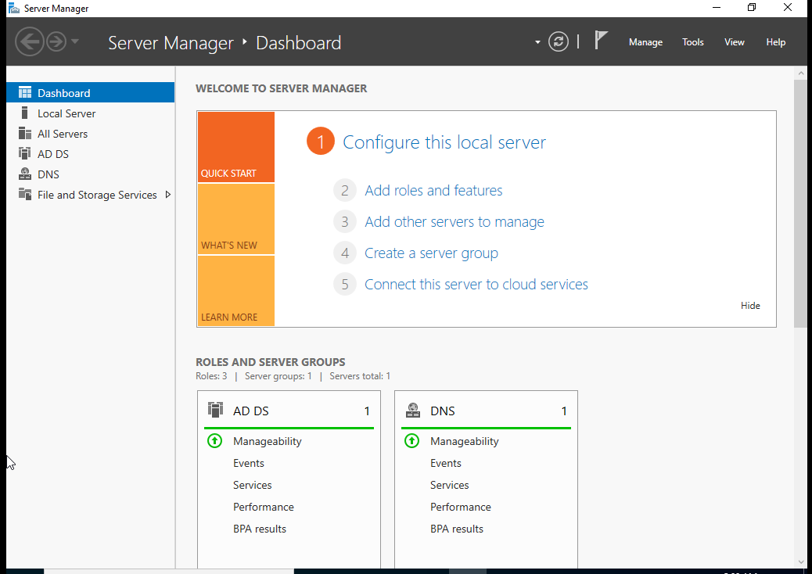
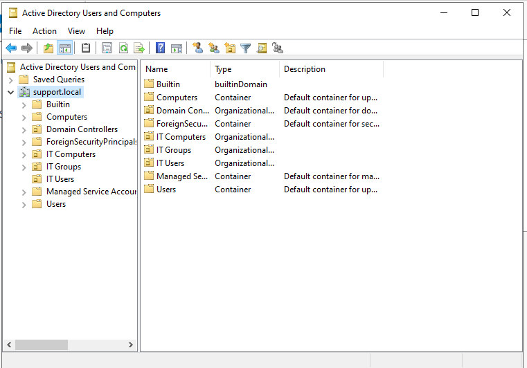

<div align="center">

# 🛡️ LAB 01 — ACTIVE DIRECTORY SETUP


> **Objective:** Install Active Directory Domain Services on Windows Server 2022 and promote the server to a domain controller — the foundation every other lab in this series is built on.

</div>

---

## 🖥️ Lab Environment

| Component | Details |
|---|---|
| Server OS | Windows Server 2022 |
| Platform | VMware Workstation Pro |
| Domain Name | support.local |
| NetBIOS Name | SUPPORT |

---

## 📚 Background

Active Directory Domain Services is a Microsoft directory service that gives administrators one central place to manage users, computers, groups, and resources across an entire network. When a server gets promoted to a domain controller it becomes the authority for authentication in the domain. Every user and computer that joins the domain checks in with the domain controller to verify credentials and receive policies.

Without a domain controller there is no domain. This lab sets that up from scratch.

---

## 🔧 Steps

### Step 1 — Open Server Manager

When Windows Server 2022 boots it opens Server Manager automatically. From the dashboard I clicked **Add roles and features** to launch the installation wizard.

---

### Step 2 — Select Installation Type

On the installation type screen I selected **Role-based or feature-based installation** and clicked Next.

---

### Step 3 — Select Destination Server

On the server selection screen my server was already listed in the server pool and selected by default. I clicked Next.

---

### Step 4 — Select the AD DS Role

On the server roles screen I checked the box next to **Active Directory Domain Services**. A popup appeared asking to add the required features for AD DS. I clicked **Add Features** then clicked Next.

---

### Step 5 — Features and AD DS Overview

On the features screen I left everything at default and clicked Next. The next screen gave an overview of what AD DS does. I clicked Next again.

---

### Step 6 — Confirm and Install

On the confirmation screen I checked the box for **Restart the destination server automatically if required** and clicked **Install**. The installation ran and completed without errors.

---

### Step 7 — Promote to Domain Controller

After the installation finished a yellow flag notification appeared in the top right corner of Server Manager. I clicked it and selected **Promote this server to a domain controller** to launch the AD DS Configuration Wizard.

---

### Step 8 — Configure the Forest

On the deployment configuration screen I selected **Add a new forest** and entered the root domain name:

```
support.local
```

I clicked Next to continue.

---

### Step 9 — Domain Controller Options

On the domain controller options screen I left all settings at default and set a password for **Directory Services Restore Mode (DSRM)**. This password is used to recover Active Directory in the event of a failure. I clicked Next.

---

### Step 10 — DNS Options

A warning appeared about DNS delegation. This is expected in a new lab environment with no existing DNS infrastructure. I clicked Next.

---

### Step 11 — NetBIOS Name

The wizard automatically assigned the NetBIOS name **SUPPORT** based on the domain name I entered. I left it as default and clicked Next.

---

### Step 12 — Paths

The paths screen showed the default storage locations for the AD database, log files, and SYSVOL folder. I left everything at default and clicked Next.

---

### Step 13 — Review and Prerequisites Check

I reviewed the configuration summary and clicked Next. The wizard ran a prerequisites check. A few yellow warnings appeared which is normal for a brand new environment. The check completed with the message confirming all prerequisites passed. I clicked **Install**.

---

### Step 14 — Restart and Log Back In

The server automatically restarted after the promotion completed. When it came back up I logged in using the domain administrator account:

```
SUPPORT\Administrator
```

---

### Step 15 — Verify in Active Directory Users and Computers

I opened **Active Directory Users and Computers** from the Tools menu in Server Manager. The domain `support.local` appeared in the left panel. I expanded it and confirmed all default containers were present.

---

## 📂 Domain Structure

| Container | Type | Purpose |
|---|---|---|
| Builtin | Container | Default security groups built into Windows Server |
| Computers | Container | Machine accounts for domain joined computers |
| Domain Controllers | Organizational Unit | Lists all domain controllers in the domain |
| ForeignSecurityPrincipals | Container | Accounts from external trusted domains |
| Managed Service Accounts | Container | Service accounts used by applications and services |
| Users | Container | Default user accounts and built in security groups |

---

## ✅ Result

The server is now a fully functioning domain controller for the `support.local` domain. Active Directory Domain Services is installed, the forest is configured, and the domain structure is verified. This environment is ready for Lab 02.

---

## 📸 Screenshots

| Screenshot | Description |
|---|---|
|  | Server Manager dashboard showing AD DS and DNS installed and running |
|  | Active Directory Users and Computers showing the full domain structure for support.local |

---

<div align="center">

**[⬅️ Back to Lab Index](../../README.md)** | **[➡️ Next: Lab 02 — User and Group Management](../02-user-group-management/README.md)**

</div>
