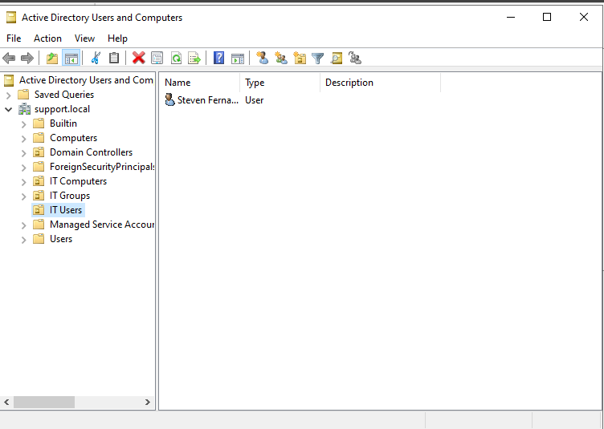
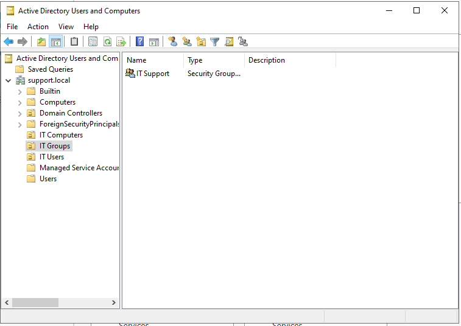
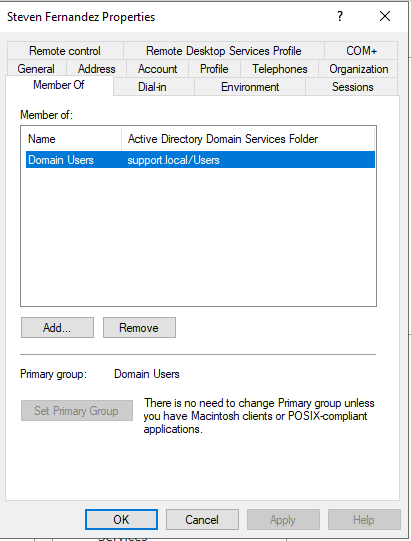
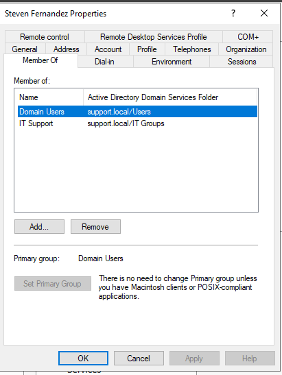

# 👥 LAB 02 — USER AND GROUP MANAGEMENT

> **Objective:** Create Organizational Units, a user account, and a security group inside Active Directory. Add the user to the group and verify membership — some of the most common tasks in any helpdesk environment.

---

## 🖥️ Lab Environment

| Component | Details |
|---|---|
| Server OS | Windows Server 2022 |
| Platform | VMware Workstation Pro |
| Domain | support.local |
| Tool | Active Directory Users and Computers |

---

## 📚 Background

In an enterprise environment administrators do not manage individual user permissions directly. Instead they organize users into Organizational Units and assign them to security groups. Permissions and policies are then applied to the group. This makes it much easier to manage access across a large number of users.

Organizational Units are containers inside Active Directory that allow you to organize objects logically and apply Group Policy to specific sets of users or machines. Security groups control what resources users can access across the network.

---

## 🔧 Steps

### Step 1 — Open Active Directory Users and Computers

I opened Server Manager and clicked **Tools** in the top right corner then selected **Active Directory Users and Computers**.

---

### Step 2 — Create Organizational Units

I right clicked on `support.local` in the left panel, hovered over **New**, and clicked **Organizational Unit**. I created three Organizational Units one at a time:

| OU Name | Purpose |
|---|---|
| IT Users | Stores all IT department user accounts |
| IT Computers | Stores all IT department computer accounts |
| IT Groups | Stores all IT department security groups |

---

### Step 3 — Create a User Account

I right clicked on the **IT Users** OU, hovered over **New**, and clicked **User**. I filled in the following information:

| Field | Value |
|---|---|
| First Name | Steven |
| Last Name | Fernandez |
| User Logon Name | sfernandez |

I clicked Next, set a temporary password, and checked **User must change password at next logon**. I clicked Next then Finish.

---

### Step 4 — Create a Security Group

I right clicked on the **IT Groups** OU, hovered over **New**, and clicked **Group**. I filled in the following:

| Field | Value |
|---|---|
| Group Name | IT Support |
| Group Scope | Global |
| Group Type | Security |

I clicked OK to create the group.

---

### Step 5 — Add User to Group

I right clicked on the **IT Support** group and clicked **Properties**. I clicked the **Members** tab then clicked **Add**. I typed `sfernandez` in the search box and clicked **Check Names** to locate the account. I clicked OK to add the user then clicked OK again to close the Properties window.

---

### Step 6 — Verify Group Membership

I right clicked on the **sfernandez** user account in the IT Users OU and clicked **Properties**. I clicked the **Member Of** tab and confirmed the user was listed as a member of both **Domain Users** and **IT Support**.

---

## ✅ Result

Three Organizational Units were created to organize the lab environment. A user account was created and placed in the IT Users OU. A security group called IT Support was created in the IT Groups OU and the user was successfully added to it. Group membership was verified through the user properties.

---

## 📸 Screenshots

| Screenshot | Description |
|---|---|
|  | IT Users OU showing the sfernandez user account |
|  | IT Groups OU showing the IT Support security group |
|  | Member Of tab before being added to IT Support |
|  | Member Of tab after being added showing Domain Users and IT Support |

---

**[⬅️ Back to Lab Index](../../README.md)** | **[➡️ Next: Lab 03 — Join Client to Domain](../03-domain-join-client/README.md)**

