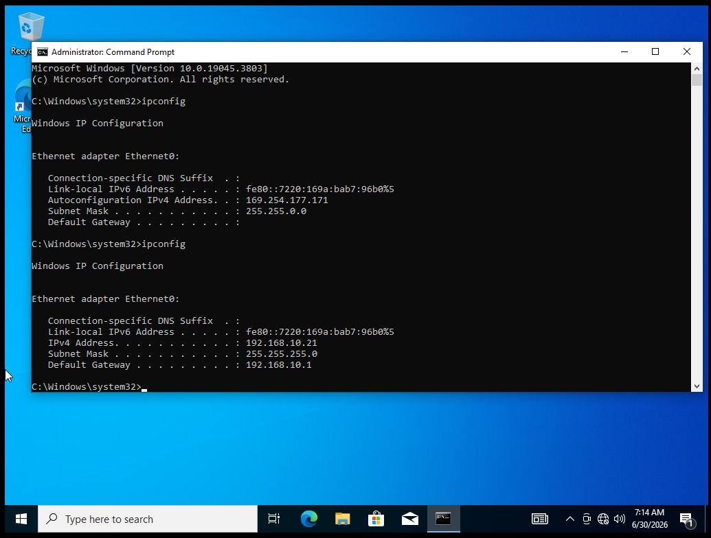
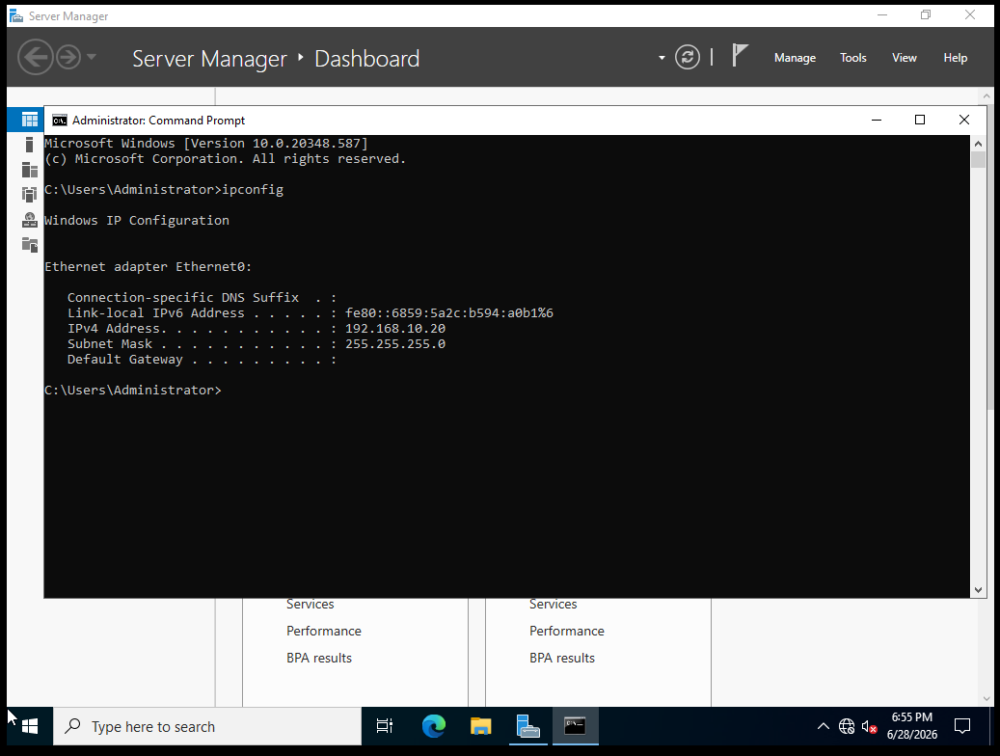
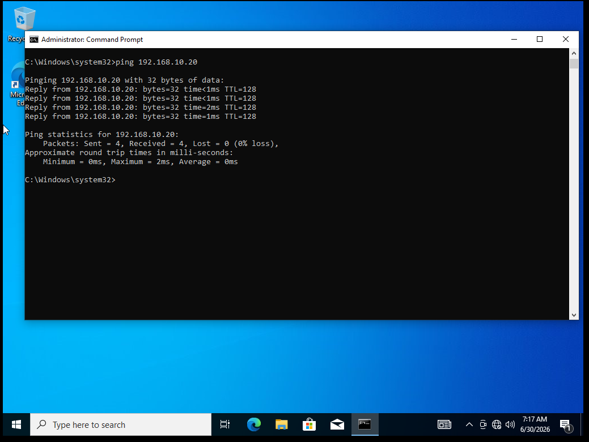
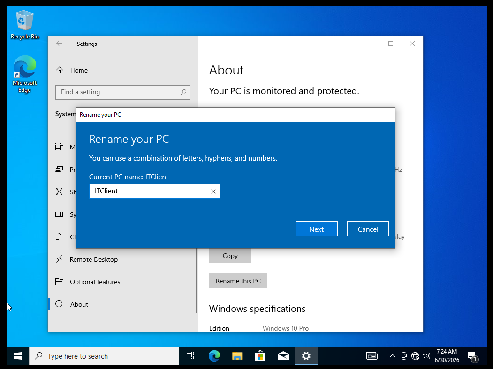
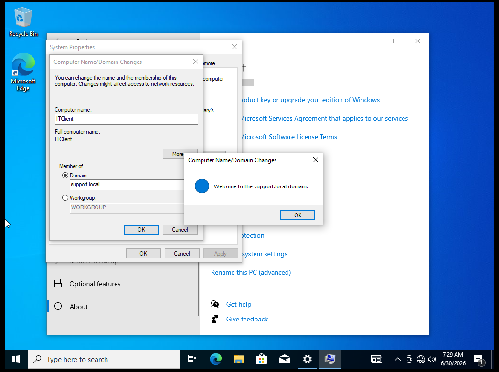
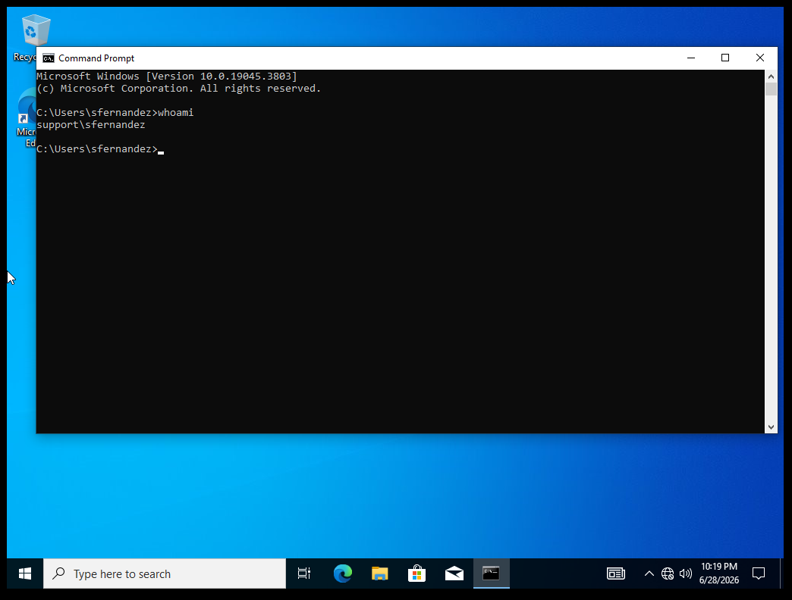
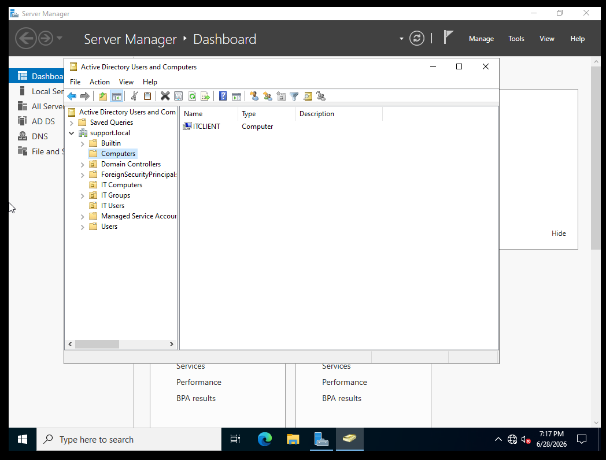

<div align="center">

# 💻 LAB 03 — JOIN CLIENT TO DOMAIN


> **Objective:** Configure a Windows 10 client with a static IP, connect it to the same network as the domain controller, and join it to the support.local domain.

</div>

---

## 🖥️ Lab Environment

| Component | Details |
|---|---|
| Client OS | Windows 10 Pro |
| Platform | VMware Workstation Pro |
| Domain | support.local |
| Client Hostname | ITClient |
| Client Static IP | 192.168.10.21 |
| Domain Controller IP | 192.168.10.20 |

---

## 📚 Background

Before a Windows client can join a domain it needs network connectivity to the domain controller and it needs to be pointed to that domain controller for DNS resolution. Domain controllers also act as DNS servers in most Active Directory environments, since DNS is what allows clients to actually locate the domain controller in the first place. Without correct DNS settings the domain join will fail even if the network connection is otherwise working.

---

## 🔧 Steps

### Step 1 — Build the Windows 10 Client VM

I created a new Windows 10 Pro virtual machine in VMware Workstation Pro using the official Windows 10 ISO downloaded from Microsoft. The VM was configured with 4GB of RAM, 2 processors, and a 60GB disk.

---

### Step 2 — Place Both VMs on the Same Network

I set both the Windows Server 2022 VM and the Windows 10 VM to use the same custom network adapter in VMware called LAN Network. This allows the two virtual machines to communicate directly with each other.

---

### Step 3 — Confirm the Domain Controller IP

On the Windows Server 2022 VM I opened Command Prompt and ran:

```
ipconfig
```

This confirmed the domain controller's static IP address as `192.168.10.20`.

---

### Step 4 — Set a Static IP on the Client

On the Windows 10 VM I opened Network Connections, opened the properties for the Ethernet adapter, and configured Internet Protocol Version 4 (TCP/IPv4) manually with the following settings:

| Setting | Value |
|---|---|
| IP Address | 192.168.10.21 |
| Subnet Mask | 255.255.255.0 |
| Default Gateway | 192.168.10.1 |
| Preferred DNS Server | 192.168.10.20 |

Setting the preferred DNS server to the domain controller's IP is what allows the client to locate the domain.

---

### Step 5 — Test Connectivity

From the Windows 10 client I ran:

```
ping 192.168.10.20
```

The ping returned 4 successful replies with 0% packet loss, confirming the client can reach the domain controller over the network.

---

### Step 6 — Rename the Computer

I renamed the client from its default name to:

```
ITClient
```

This was done through System Properties so the machine would be easily identifiable once it appeared in Active Directory.

---

### Step 7 — Join the Domain

I opened System Properties, clicked the Computer Name tab, clicked Change, selected the Domain radio button, and entered:

```
support.local
```

When prompted I authenticated with domain administrator credentials:

```
SUPPORT\Administrator
```

A welcome message confirmed the computer successfully joined the support.local domain. I restarted the VM to complete the process.

---

### Step 8 — Log In With a Domain Account

After the restart I selected **Other user** at the login screen and signed in using a domain user account:

```
SUPPORT\sfernandez
```

The login was successful, confirming the client is authenticating against the domain controller rather than a local account.

---

### Step 9 — Verify From the Server Side

Back on Windows Server 2022 I opened Active Directory Users and Computers and checked the default **Computers** container. The computer object **ITClient** appeared there, confirming the domain join was successful and recorded in Active Directory.

---

## ✅ Result

The Windows 10 client was successfully configured with a static IP, connected to the domain controller's network, and joined to the support.local domain. A domain user account was used to log in successfully, and the computer object appeared correctly in Active Directory on the server side. This client is now ready to be used for Group Policy and remote support labs later in this series.

---

## 📸 Screenshots

| Screenshot | Description |
|---|---|
|  | Windows 10 client showing an APIPA address before static IP was configured |
|  | Windows Server 2022 ipconfig confirming the domain controller's static IP |
|  | Successful ping test from the client to the domain controller with 0% packet loss |
|  | Renaming the client computer to ITClient |
|  | Welcome message confirming the computer joined the support.local domain |
|  | Logged in to the client using the domain account SUPPORT\sfernandez |
|  | ITClient appearing in the Computers container in Active Directory Users and Computers |

---

<div align="center">

**[⬅️ Back to Lab Index](../../README.md)** | **[➡️ Next: Lab 04 — Group Policy](../04-group-policy/README.md)**

</div>
