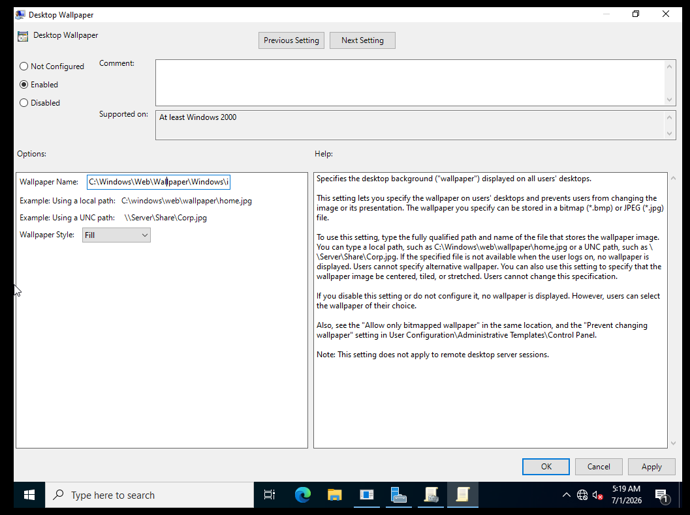
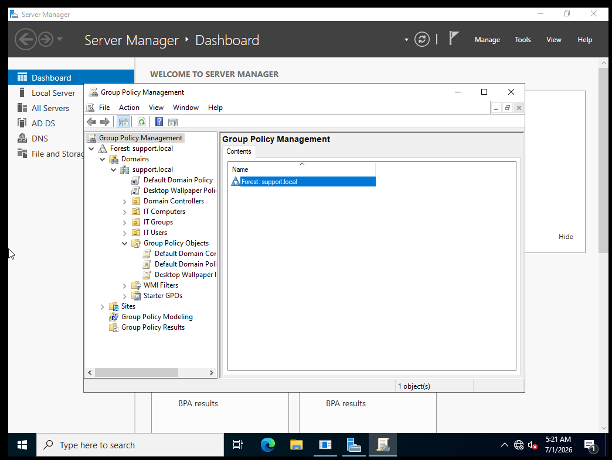
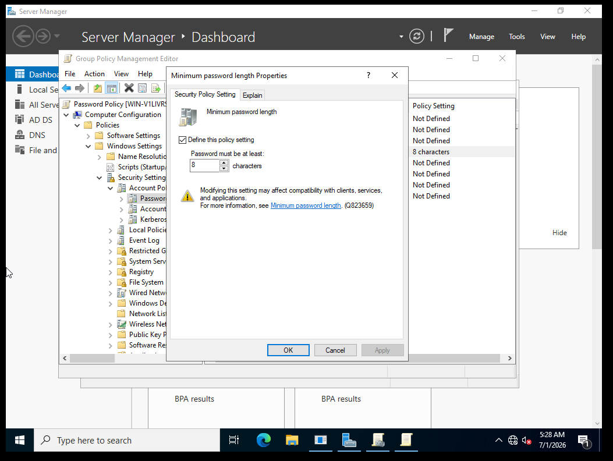
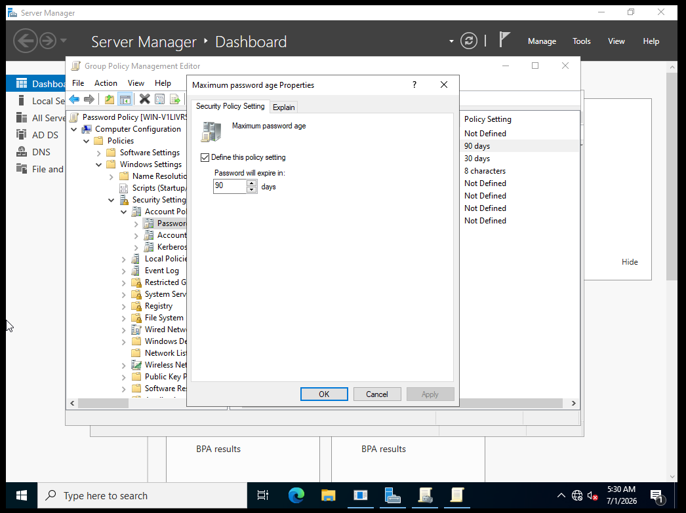
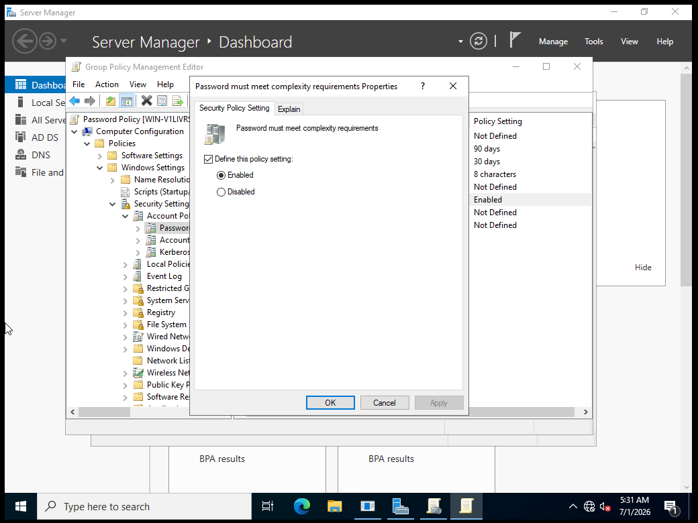
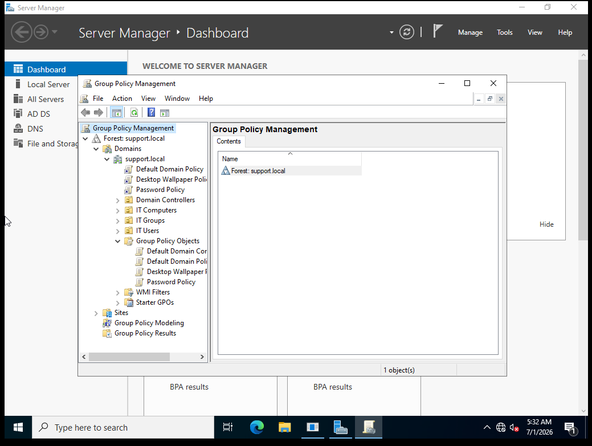
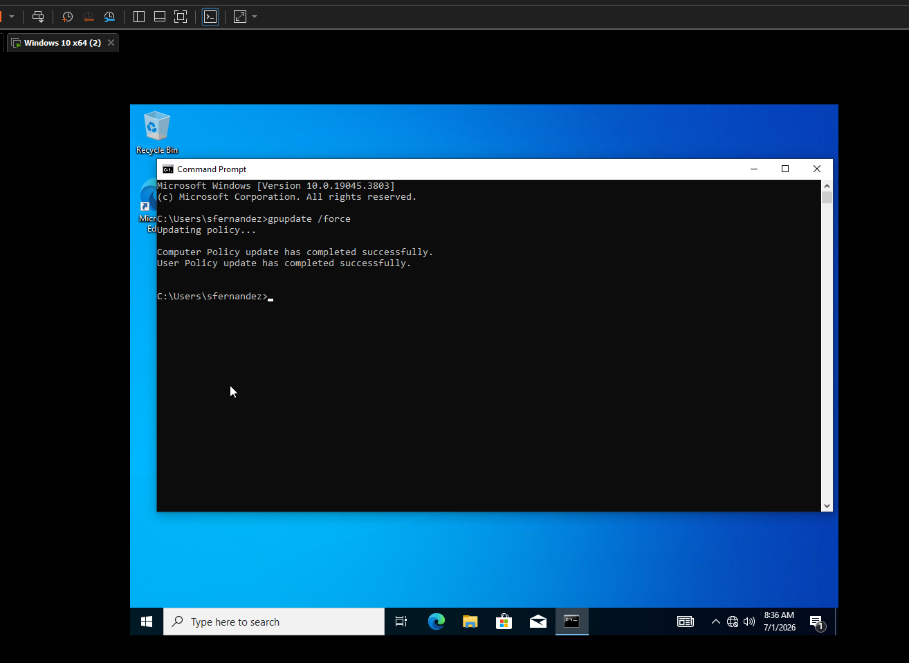

<div align="center">

# 🛠️ LAB 04 — GROUP POLICY


> **Objective:** Create and link Group Policy Objects to enforce a desktop wallpaper setting and a password policy across the support.local domain, then verify the policies applied successfully on the Windows 10 client.

</div>

---

## 🖥️ Lab Environment

| Component | Details |
|---|---|
| Server OS | Windows Server 2022 |
| Client OS | Windows 10 Pro |
| Platform | VMware Workstation Pro |
| Domain | support.local |
| Tool | Group Policy Management Console |

---

## 📚 Background

Group Policy is one of the most powerful tools in an Active Directory environment. It allows administrators to push configurations, restrictions, and settings out to users and computers across the entire domain without touching each machine individually. When a user logs in or a computer starts up it checks in with the domain controller and applies any Group Policy Objects linked to it.

In a helpdesk environment Group Policy is used to enforce security standards, lock down desktop settings, map drives, push software, and much more. Understanding how to create and link GPOs is a core skill for any IT support role.

---

## 🔧 Steps

### Step 1 — Open Group Policy Management

On Windows Server 2022 I clicked **Tools** in Server Manager and selected **Group Policy Management**. I expanded **Domains** then **support.local** to see the existing policies and structure.

---

### Step 2 — Create the Desktop Wallpaper Policy

I right clicked on **Group Policy Objects** under support.local and clicked **New**. I named the new GPO:

```
Desktop Wallpaper Policy
```

I right clicked the new GPO and clicked **Edit** to open the Group Policy Management Editor.

---

### Step 3 — Configure the Wallpaper Setting

Inside the editor I navigated to:

```
User Configuration > Policies > Administrative Templates > Desktop > Desktop
```

I double clicked **Desktop Wallpaper**, set it to **Enabled**, and entered the following wallpaper path:

```
C:\Windows\Web\Wallpaper\Windows\img0.jpg
```

I set the Wallpaper Style to **Fill** then clicked **Apply** and **OK**.

---

### Step 4 — Link the Desktop Wallpaper Policy

I closed the editor and went back to Group Policy Management. I right clicked on **support.local** and clicked **Link an Existing GPO**. I selected **Desktop Wallpaper Policy** and clicked OK. The GPO now appeared linked under support.local alongside the Default Domain Policy.

---

### Step 5 — Create the Password Policy

I right clicked on **Group Policy Objects** again and clicked **New**. I named the new GPO:

```
Password Policy
```

I right clicked it and clicked **Edit** to open the editor.

---

### Step 6 — Configure Password Settings

Inside the editor I navigated to:

```
Computer Configuration > Policies > Windows Settings > Security Settings > Account Policies > Password Policy
```

I configured the following settings:

| Setting | Value |
|---|---|
| Minimum Password Length | 8 characters |
| Maximum Password Age | 90 days |
| Password Must Meet Complexity Requirements | Enabled |

Each setting was enabled by checking **Define this policy setting**, setting the value, and clicking **Apply** then **OK**.

---

### Step 7 — Link the Password Policy

I closed the editor and right clicked on **support.local** in Group Policy Management. I clicked **Link an Existing GPO**, selected **Password Policy**, and clicked OK. Both GPOs are now linked and visible under support.local.

---

### Step 8 — Force a Group Policy Update on the Client

I switched to the Windows 10 client VM and logged in as the domain user `SUPPORT\sfernandez`. I opened Command Prompt and ran:

```
gpupdate /force
```

The command completed successfully, confirming the client pulled down the updated policies from the domain controller.

---

## ✅ Result

Two Group Policy Objects were created and linked to the support.local domain. The Desktop Wallpaper Policy enforces a standard wallpaper across all domain users. The Password Policy enforces an 8 character minimum length, 90 day maximum age, and complexity requirements. Both policies were applied successfully to the Windows 10 client using gpupdate /force.

---

## 📸 Screenshots

| Screenshot | Description |
|---|---|
|  | Desktop Wallpaper GPO configured with the wallpaper path and fill style |
|  | Desktop Wallpaper Policy linked under support.local in Group Policy Management |
|  | Minimum password length set to 8 characters |
|  | Maximum password age set to 90 days |
|  | Password complexity requirements enabled |
|  | Both GPOs linked and visible under support.local |
|  | gpupdate /force completed successfully on the Windows 10 client |

---

<div align="center">

**[⬅️ Back to Lab Index](../../README.md)** | **[➡️ Next: Lab 05 — DNS and DHCP](../05-dns-dhcp/README.md)**

</div>
