<div align="center">

# 🌐 LAB 05 — DNS AND DHCP


> **Objective:** Explore and manage DNS records in the support.local zone, create a custom A record, verify DNS resolution from the client, install and configure the DHCP Server role, create a scope, and confirm the Windows 10 client receives an IP address automatically.

</div>

---

## 🖥️ Lab Environment

| Component | Details |
|---|---|
| Server OS | Windows Server 2022 |
| Client OS | Windows 10 Pro |
| Platform | VMware Workstation Pro |
| Domain | support.local |
| Domain Controller IP | 192.168.10.20 |
| DHCP Scope Range | 192.168.10.100 to 192.168.10.200 |

---

## 📚 Background

**DNS** translates hostnames into IP addresses. In an Active Directory environment the domain controller also acts as the DNS server. When a client types `support.local` to join the domain or tries to reach a shared resource by name, DNS is what resolves that name to an IP address. When DNS breaks, users cannot log in, cannot find shared drives, and cannot reach internal resources. Troubleshooting DNS is one of the most common tasks in IT support.

**DHCP** automatically assigns IP addresses to devices on a network. Without DHCP every device would need a manually configured static IP address. In a helpdesk role you will regularly troubleshoot DHCP issues when clients get APIPA addresses in the 169.254.x.x range or when IP conflicts occur on the network.

---

## 🔧 Steps

### Step 1 — Open DNS Manager

On Windows Server 2022 I clicked **Tools** in Server Manager and selected **DNS**. This opened the DNS Manager console where I could see the server and its configured zones.

---

### Step 2 — Review Forward Lookup Zones

I expanded the server in the left panel and clicked on **Forward Lookup Zones**. Two zones were listed:

| Zone | Purpose |
|---|---|
| _msdcs.support.local | Microsoft Domain Controller Services zone created automatically by Active Directory |
| support.local | The primary DNS zone for the domain |

---

### Step 3 — Review Existing DNS Records

I clicked on **support.local** to view its records. The following records were already present from when the domain was built and the client joined:

| Record | Type | IP Address |
|---|---|---|
| Domain Controller | Host (A) | 192.168.10.20 |
| ITClient | Host (A) | 192.168.10.21 |
| win-v1livrsi0hi | Host (A) | 192.168.10.20 |

The ITClient record was created automatically when the Windows 10 machine joined the domain.

---

### Step 4 — Create a New DNS A Record

I right clicked on **support.local** and clicked **New Host (A or AAAA)**. I filled in the following:

| Field | Value |
|---|---|
| Name | fileserver |
| IP Address | 192.168.10.30 |

I clicked **Add Host** to create the record. The new entry `fileserver` pointing to `192.168.10.30` appeared in the zone records.

---

### Step 5 — Verify DNS Resolution From the Client

I switched to the Windows 10 client VM and opened Command Prompt. I ran:

```
nslookup fileserver.support.local
```

The query returned the correct IP address `192.168.10.30` confirming that DNS resolution is working and the new record is being served correctly by the domain controller.

---

### Step 6 — Install the DHCP Server Role

Back on Windows Server 2022 I opened Server Manager and clicked **Add roles and features**. I selected **DHCP Server** from the server roles list and clicked **Add Features** when prompted. I clicked through the remaining screens and clicked **Install**. The installation completed successfully.

After the installation finished I clicked **Complete DHCP configuration** from the results screen and clicked **Commit** to authorize the DHCP server in Active Directory.

---

### Step 7 — Create a DHCP Scope

I opened **DHCP** from the Tools menu in Server Manager. I expanded the server, right clicked on **IPv4**, and clicked **New Scope** to launch the New Scope Wizard.

I named the scope:

```
IT Lab Scope
```

I configured the IP address range as follows:

| Setting | Value |
|---|---|
| Start IP Address | 192.168.10.100 |
| End IP Address | 192.168.10.200 |
| Subnet Mask | 255.255.255.0 |

---

### Step 8 — Configure Scope Options

During the wizard I configured the following DHCP options that get handed out to clients along with their IP address:

| Option | Value |
|---|---|
| Default Gateway | 192.168.10.1 |
| DNS Server | 192.168.10.20 |

I selected **Yes, I want to activate this scope now** and clicked **Finish**. The scope became active immediately.

---

### Step 9 — Set the Client to Obtain IP Automatically

On the Windows 10 client I opened Network Connections, opened the properties for the Ethernet adapter, and selected **Internet Protocol Version 4 (TCP/IPv4)**. I changed both settings to automatic:

- Obtain an IP address automatically
- Obtain DNS server address automatically

I clicked OK to apply the changes.

---

### Step 10 — Test DHCP Assignment

From an elevated PowerShell prompt on the Windows 10 client I ran:

```
ipconfig /release
ipconfig /renew
ipconfig
```

The client received the IP address `192.168.10.100` which is the first address in the DHCP scope range. The default gateway was correctly set to `192.168.10.1` confirming the scope options were applied.

---

### Step 11 — Verify the Lease on the Server

Back on the server I opened DHCP, expanded **IPv4**, expanded **IT Lab Scope**, and clicked **Address Leases**. The client `ITClient.support.local` appeared with the assigned IP `192.168.10.100` and a lease expiration date confirming the DHCP server recorded the assignment successfully.

---

## ✅ Result

DNS was explored and a new A record for `fileserver` was created and verified from the client using nslookup. The DHCP Server role was installed and configured with a scope covering the range `192.168.10.100` to `192.168.10.200`. The Windows 10 client successfully received an IP address from the scope and the lease was confirmed in the DHCP console on the server.

---

## 📸 Screenshots

| Screenshot | Description |
|---|---|
| 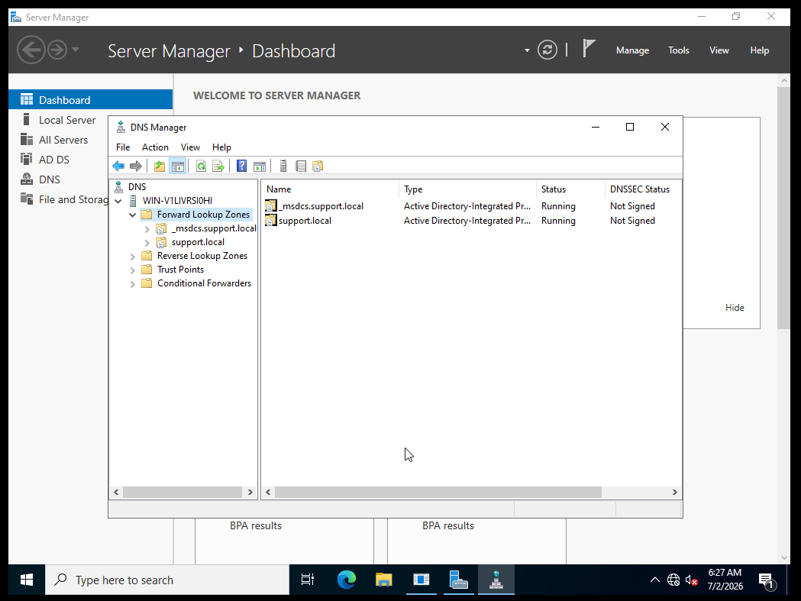 | DNS Manager showing the Forward Lookup Zones including support.local |
| 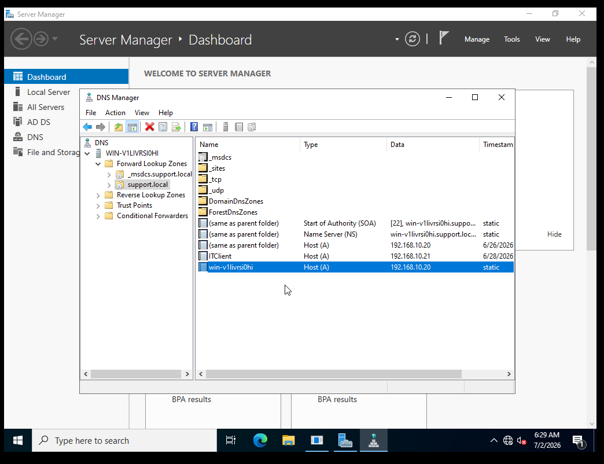 | Existing DNS records inside support.local including ITClient and the domain controller |
| 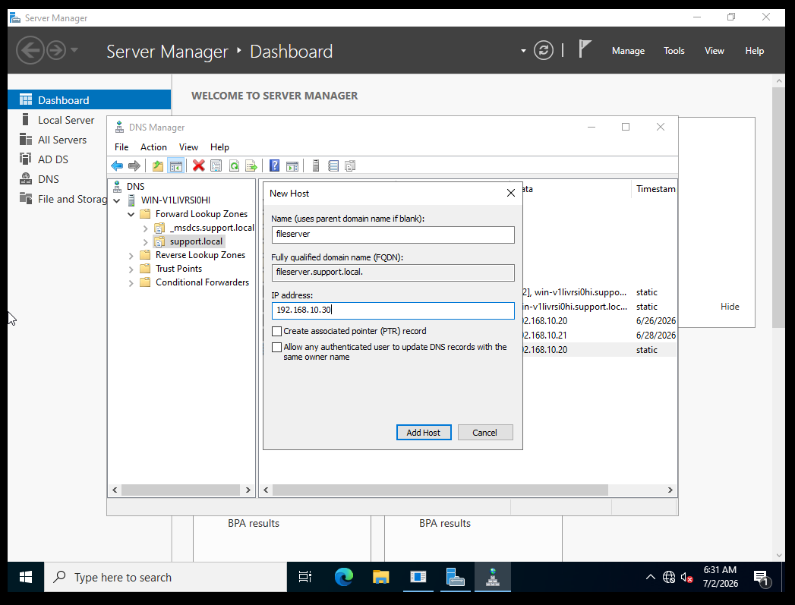 | New Host dialog with fileserver name and IP 192.168.10.30 |
| 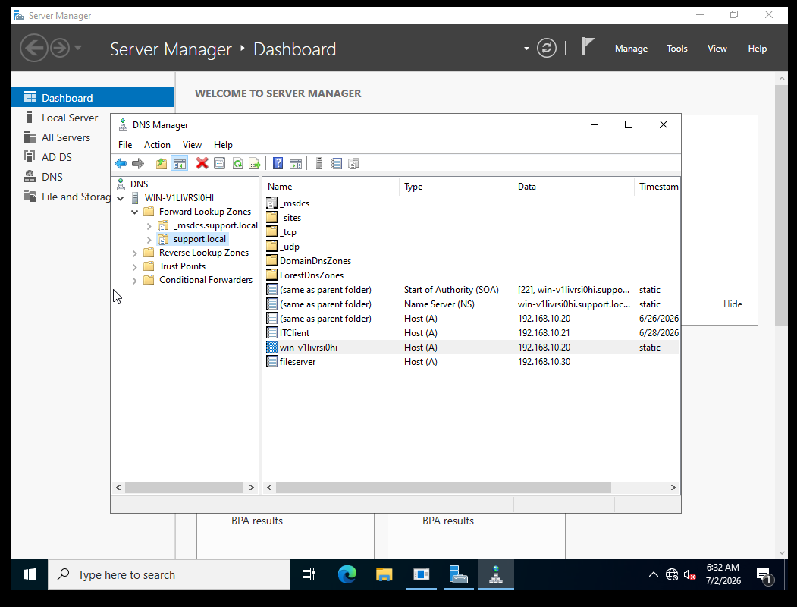 | DNS records showing the fileserver A record added at the bottom |
| 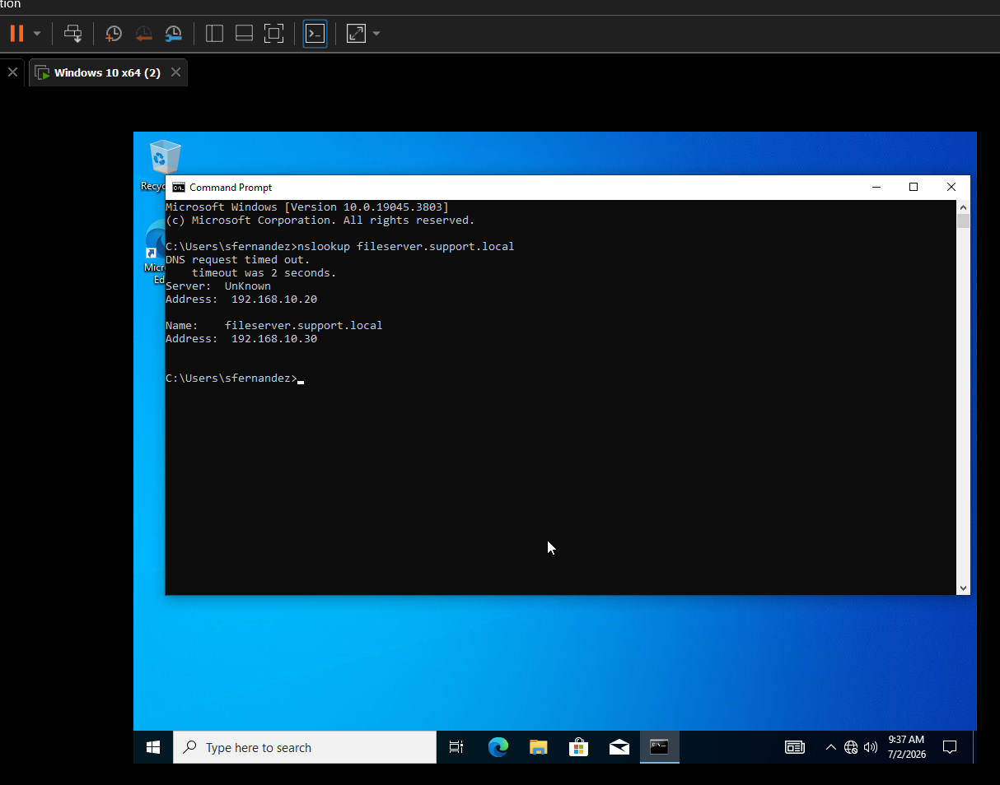 | nslookup from the Windows 10 client resolving fileserver.support.local to 192.168.10.30 |
| 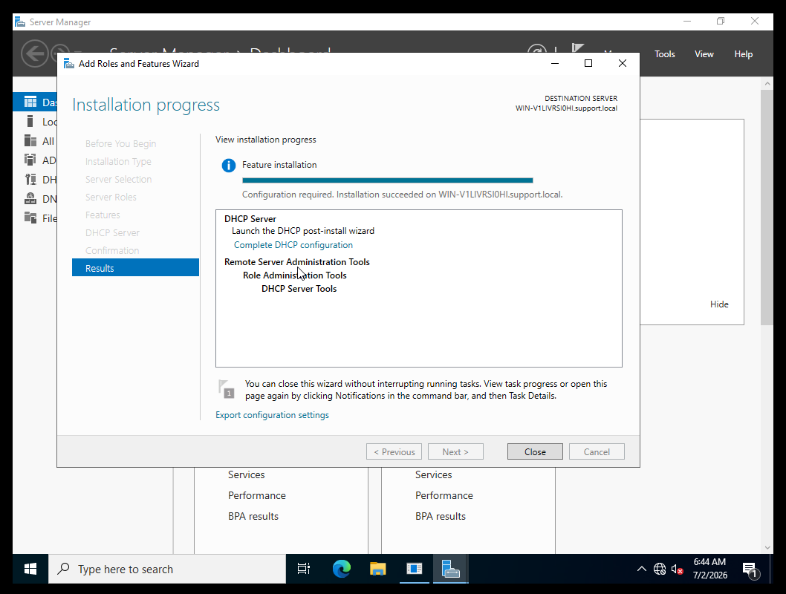 | DHCP Server role installation completed successfully |
| 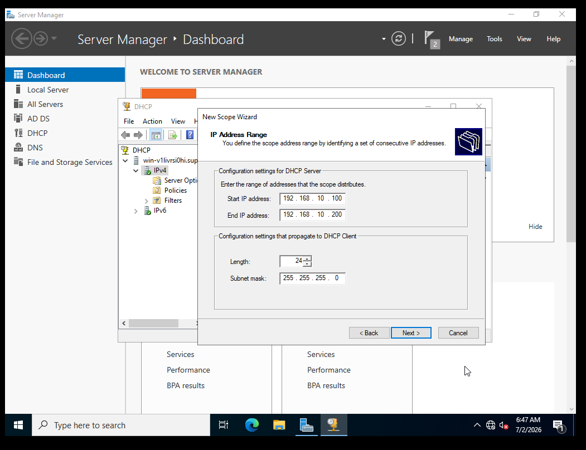 | New Scope Wizard showing the IP range 192.168.10.100 to 192.168.10.200 |
| 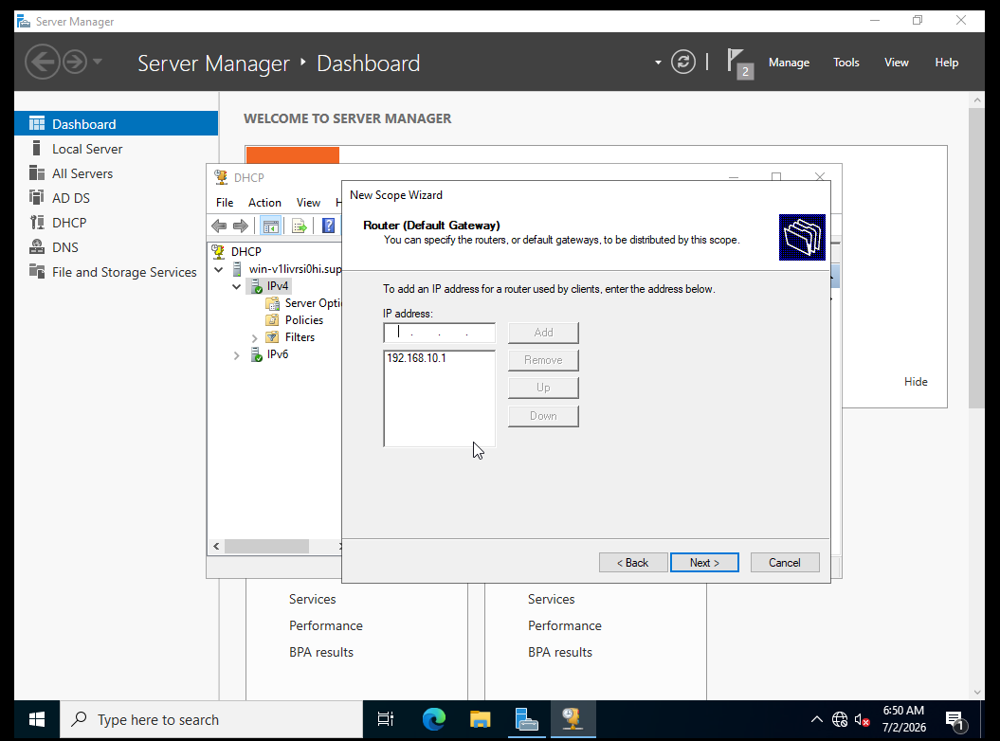 | Scope option configured with default gateway 192.168.10.1 |
| 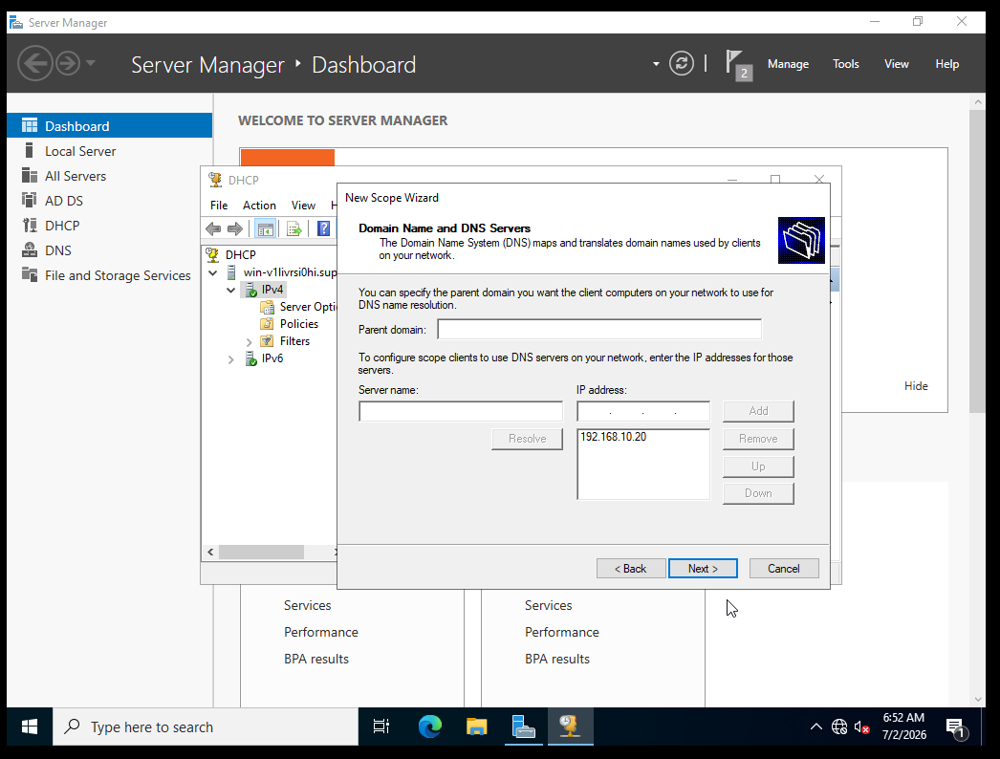 | Scope option configured with DNS server 192.168.10.20 |
| 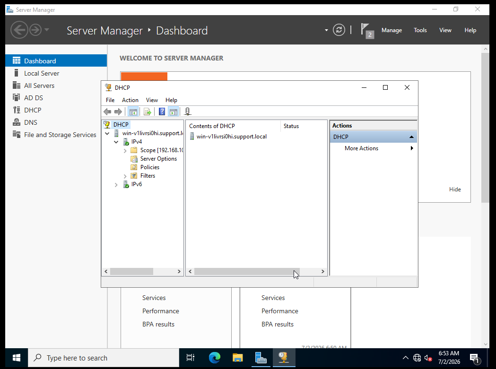 | DHCP console showing the IT Lab Scope activated under IPv4 |
| 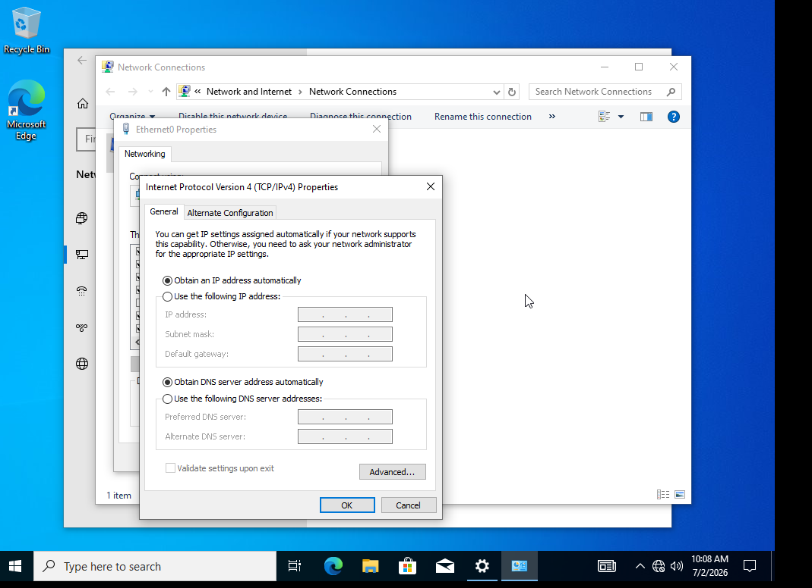 | Windows 10 client TCP/IPv4 properties set to obtain IP automatically |
| 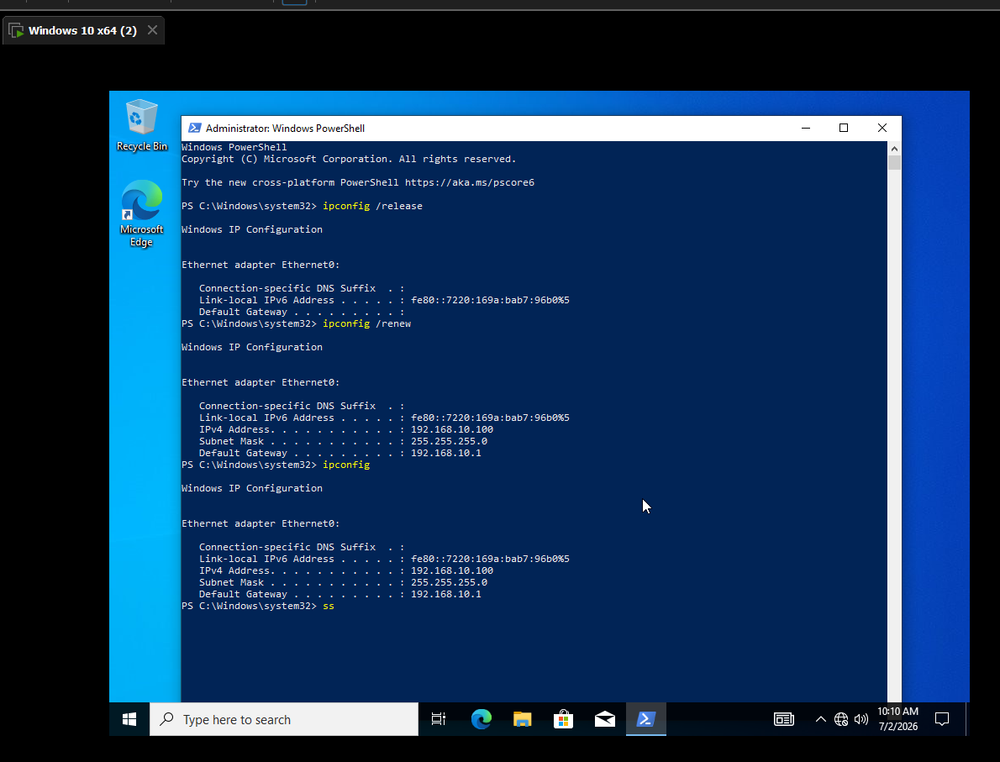 | ipconfig showing the client received 192.168.10.100 from the DHCP scope |
| 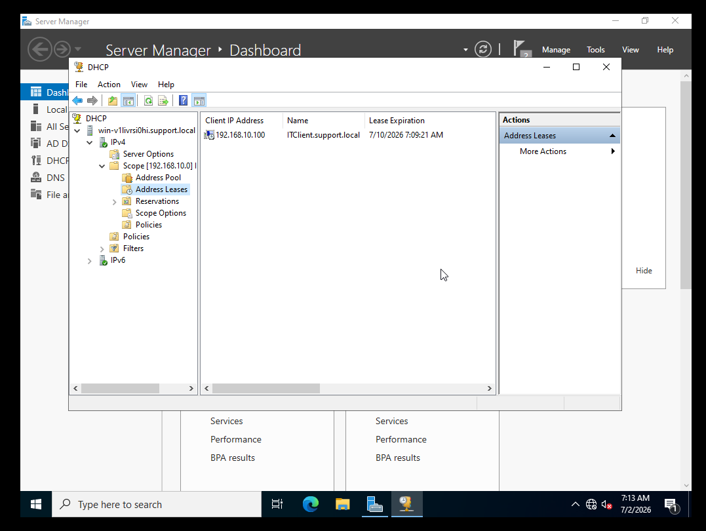 | DHCP Address Leases showing ITClient assigned 192.168.10.100 |

---

<div align="center">

**[⬅️ Back to Lab Index](../../README.md)** | **[➡️ Next: Lab 06 — File Shares and Permissions](../06-file-shares-permissions/README.md)**

</div>
