<div align="center">

# 📁 LAB 06 — FILE SHARES AND PERMISSIONS


> **Objective:** Create a shared folder on Windows Server 2022, configure share and NTFS permissions for the IT Support group, troubleshoot access issues, and verify that a domain user can successfully access and write to the share from the Windows 10 client.

</div>

---

## 🖥️ Lab Environment

| Component | Details |
|---|---|
| Server OS | Windows Server 2022 |
| Client OS | Windows 10 Pro |
| Platform | VMware Workstation Pro |
| Domain | support.local |
| Share Name | IT Share |
| Share Path | C:\IT Share |

---

## 📚 Background

File shares are one of the most common resources managed in an enterprise environment. When a user gets an access denied error on a network share it is almost always a permissions issue at either the share level or the NTFS level, or both. Understanding the difference between these two layers is essential for any helpdesk technician.

**Share permissions** control who can access the folder over the network. They are the first gate a user hits when connecting to a UNC path.

**NTFS permissions** control what a user can do with the files and folders once they are inside. These apply both locally and over the network and are more granular than share permissions.

Both layers must allow access for a user to successfully read or write to a shared folder. If either one denies access the user will get an error.

---

## 🔧 Steps

### Step 1 — Create the Shared Folder

On Windows Server 2022 I opened File Explorer and navigated to the C: drive. I created a new folder called:

```
IT Share
```

---

### Step 2 — Configure Share Permissions

I right clicked on **IT Share**, clicked **Properties**, then clicked the **Sharing** tab. I clicked **Advanced Sharing** and checked the box to share the folder. I then clicked **Permissions** and removed the default **Everyone** entry. I clicked **Add** and added the **IT Support** security group, granting it Full Control at the share level. I clicked Apply and OK.

---

### Step 3 — Configure NTFS Permissions

I went back to the **Security** tab in the IT Share Properties window. I clicked **Edit** and added the **IT Support** group. I granted it **Modify** permission which allows users to read, write, and delete files without giving them the ability to change folder permissions. I clicked Apply and OK.

---

### Step 4 — Enable File and Printer Sharing

When testing access from the client the connection was initially blocked. I opened **Network and Sharing Center** on the server, clicked **Change advanced sharing settings**, and turned on **Network discovery** and **File and printer sharing** for the Private network profile. I also ran the following command in PowerShell to ensure the firewall rules were active:

```
Get-NetFirewallRule -DisplayGroup "File and Printer Sharing" | Set-NetFirewallRule -Enabled True
```

---

### Step 5 — Verify the Share Exists

I ran the following command in PowerShell on the server to confirm the share was created:

```
Get-SmbShare
```

The output confirmed that IT Share was listed pointing to `C:\IT Share`.

---

### Step 6 — Troubleshoot NTFS Permissions

After enabling file sharing the client still received an access denied error. I investigated the NTFS permissions on the folder and found that IT Support had only been granted **Read and execute** instead of **Modify**. I opened the Advanced Security Settings for the folder, double clicked the IT Support entry, and checked the **Modify** box. I clicked OK and Apply to save the change.

---

### Step 7 — Access the Share From the Client

On the Windows 10 client logged in as `SUPPORT\sfernandez` I opened File Explorer and navigated to:

```
\\192.168.10.20\IT Share
```

The share opened successfully confirming that both the share permissions and NTFS permissions were now configured correctly.

---

### Step 8 — Test Write Access

Inside the IT Share I right clicked and created a new folder called `test` to confirm that the domain user had write access and not just read access. The folder was created successfully.

---

## ✅ Result

A shared folder called IT Share was created on Windows Server 2022 and configured with share and NTFS permissions for the IT Support group. After troubleshooting a permissions misconfiguration and enabling file sharing on the server, the Windows 10 domain user sfernandez was able to successfully access the share over the network and create files inside it.

---

## 📸 Screenshots

| Screenshot | Description |
|---|---|
| 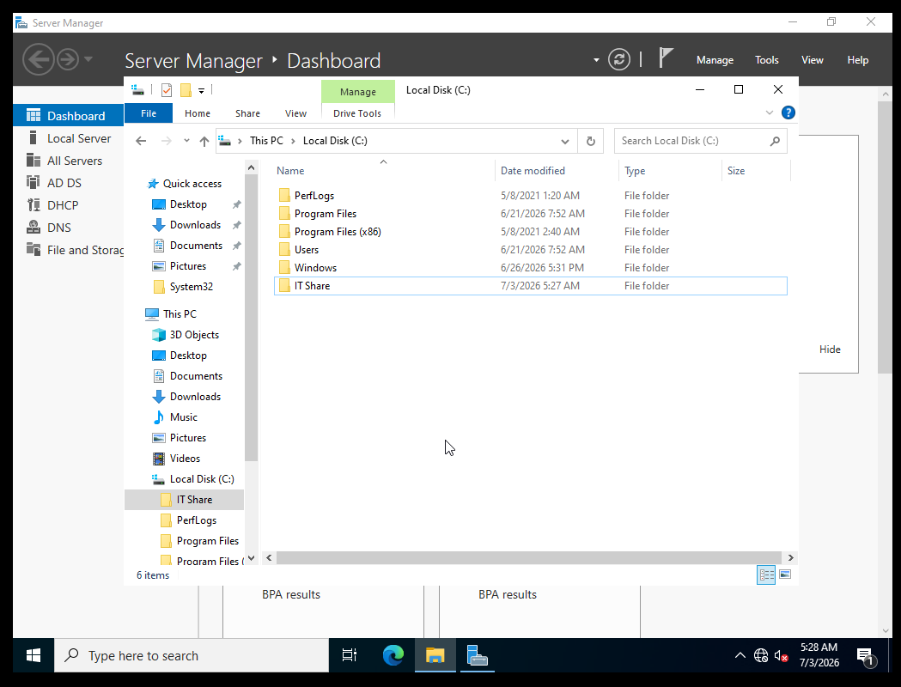 | IT Share folder created on the C: drive of Windows Server 2022 |
| 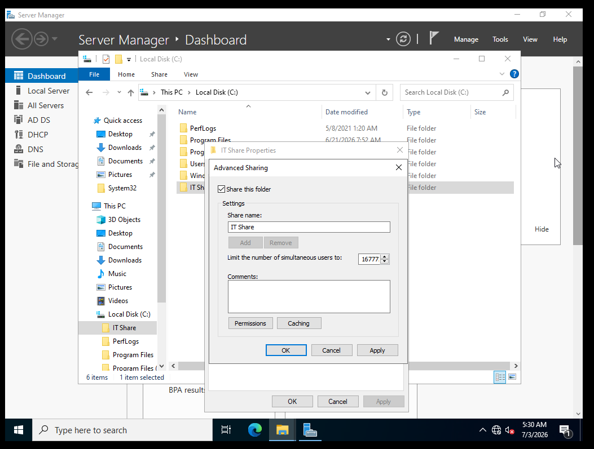 | Advanced Sharing dialog with the folder configured as a shared resource |
| 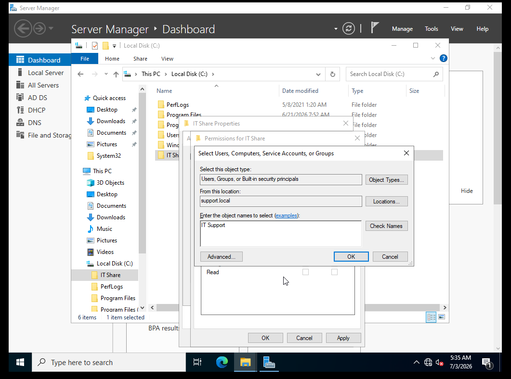 | Share permissions with Everyone removed |
| 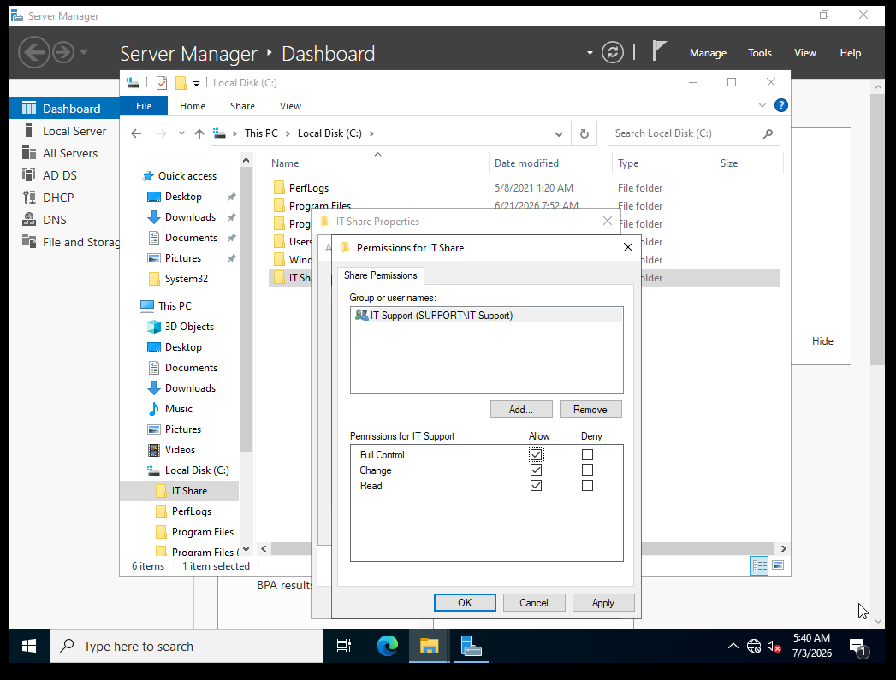 | IT Support group added with Full Control at the share level |
| 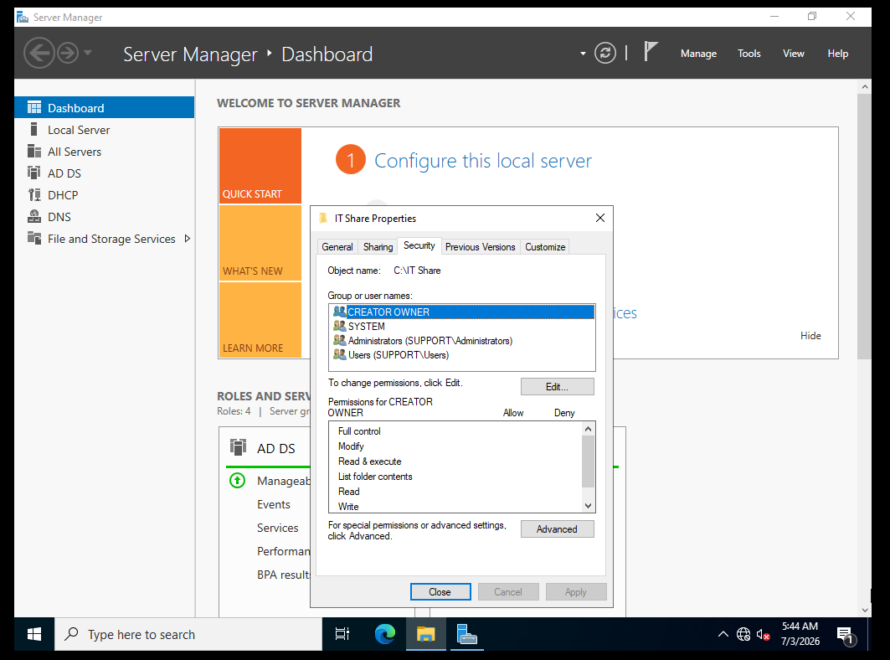 | Security tab showing default NTFS permission entries |
| 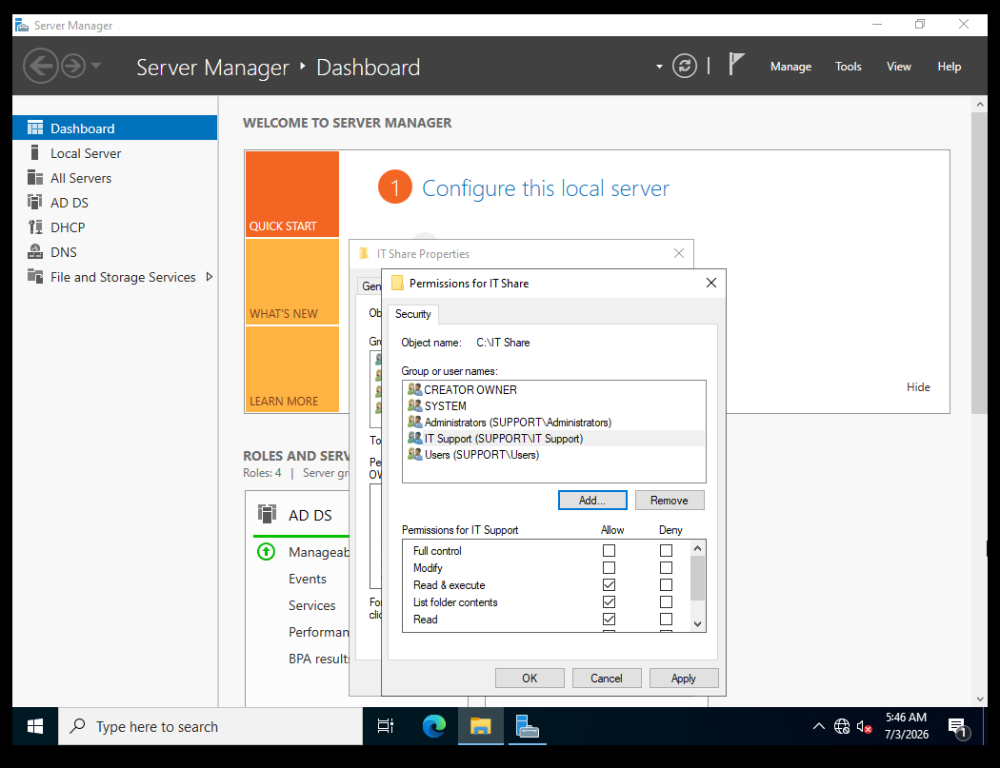 | IT Support added to NTFS permissions |
| 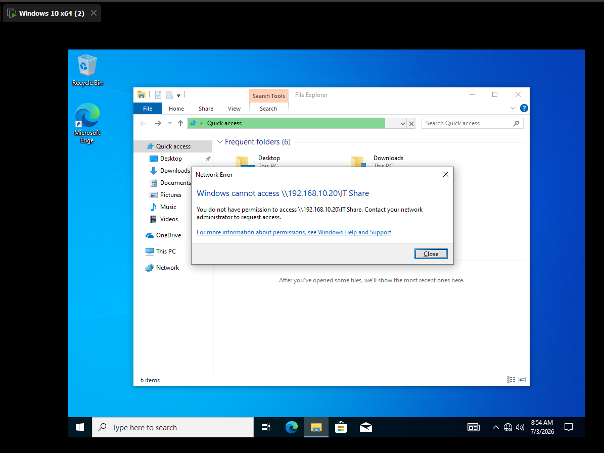 | Access denied error encountered during troubleshooting before permissions were corrected |
| 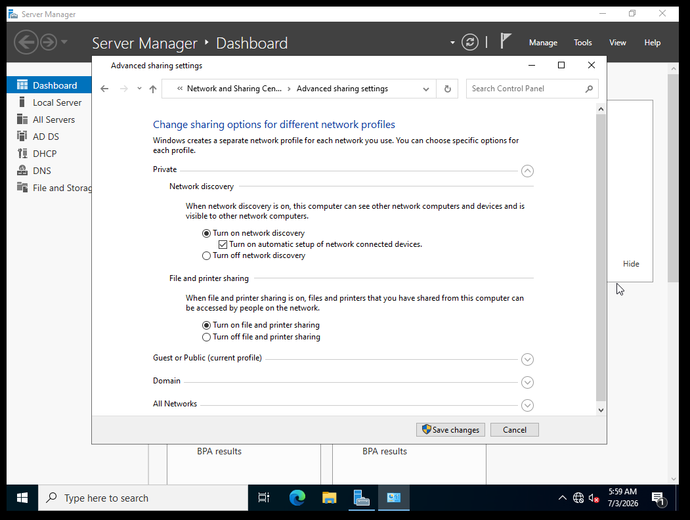 | Network and Sharing Center with file and printer sharing turned on |
| 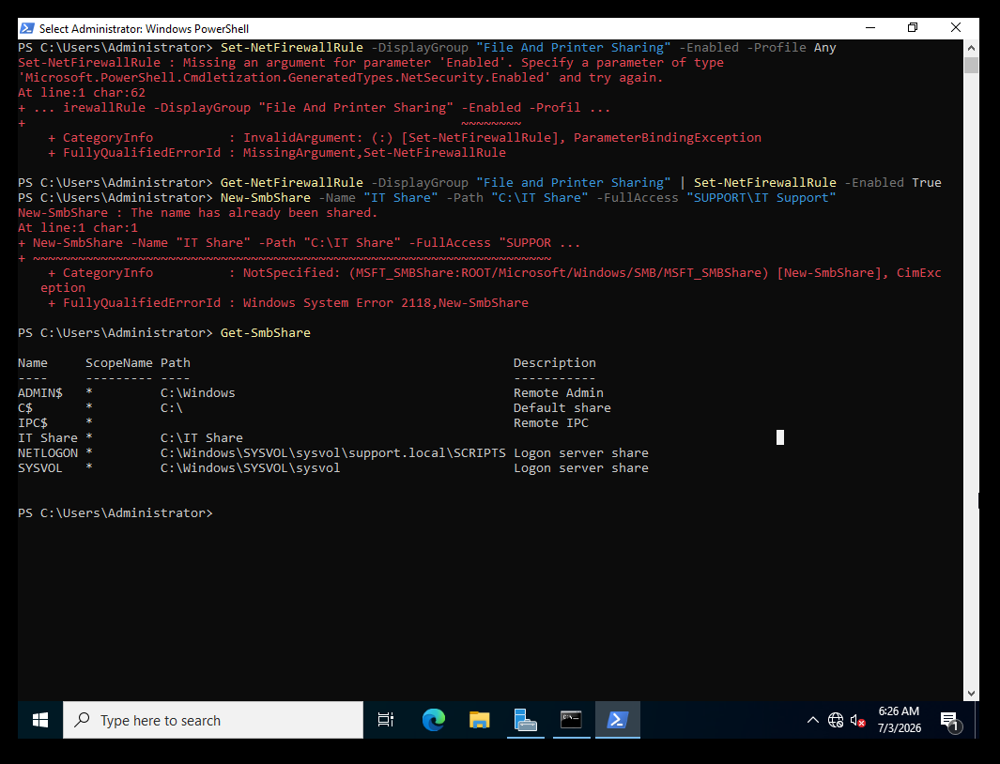 | PowerShell Get-SmbShare output confirming IT Share exists on the server |
| 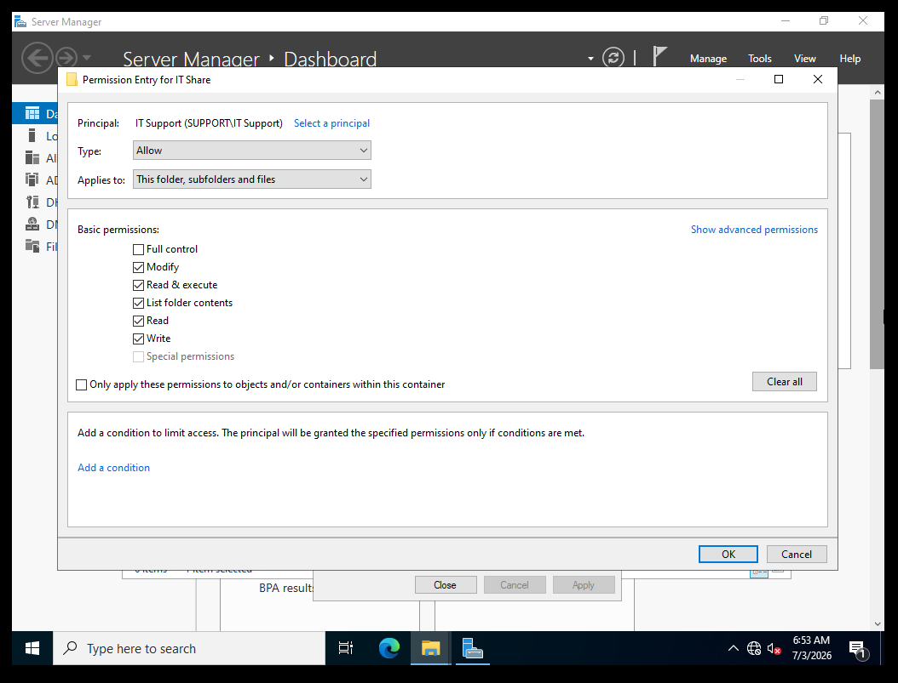 | IT Support permission entry updated to include Modify access |
| 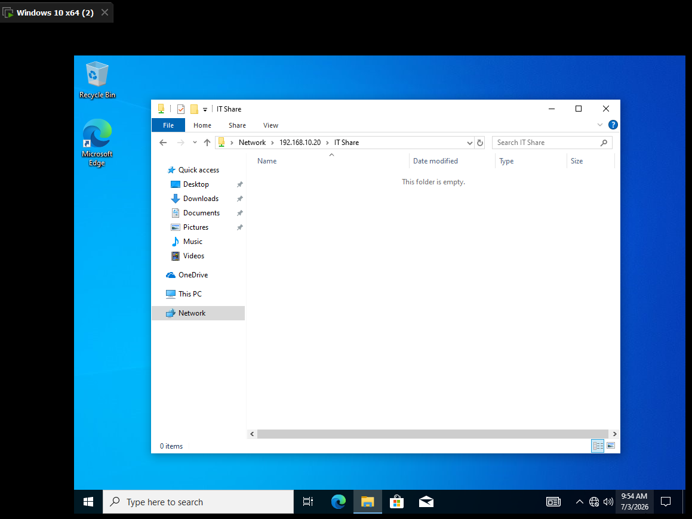 | IT Share successfully opened from the Windows 10 client over the network |
| 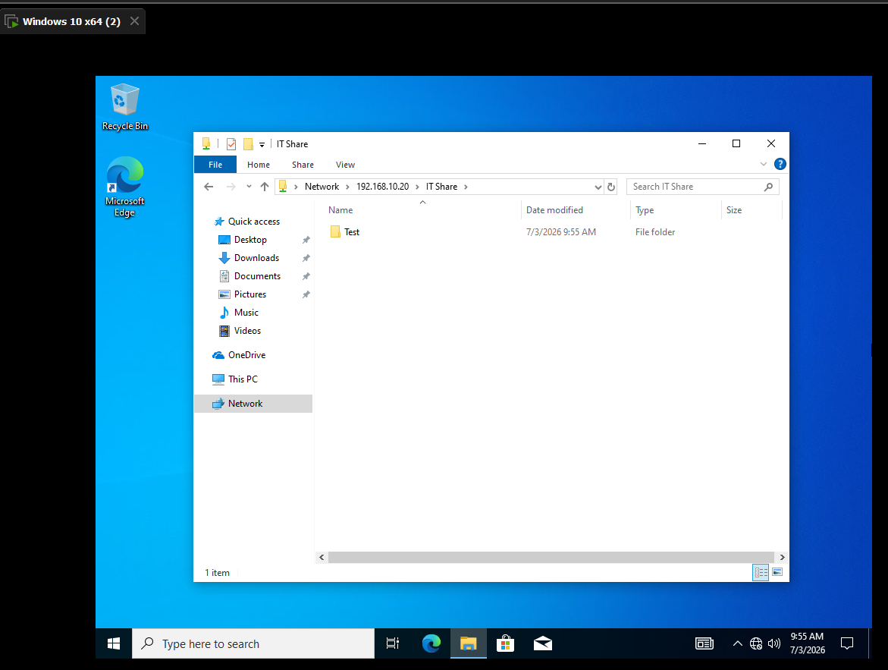 | Test folder created inside IT Share confirming write access works |

---

<div align="center">

**[⬅️ Back to Lab Index](../../README.md)** | **[➡️ Next: Lab 07 — Remote Support](../07-remote-support/README.md)**

</div>
