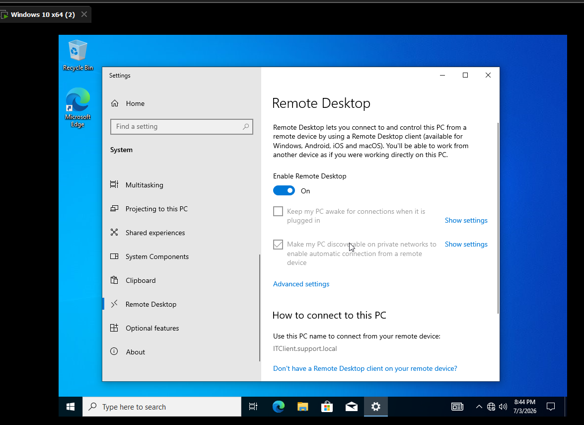
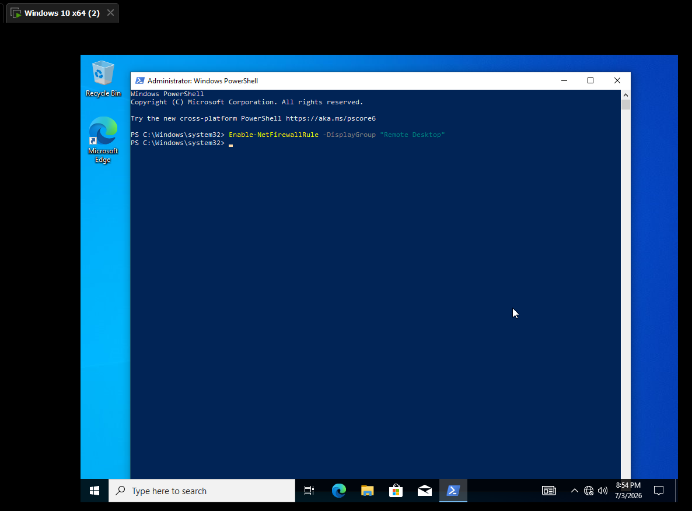
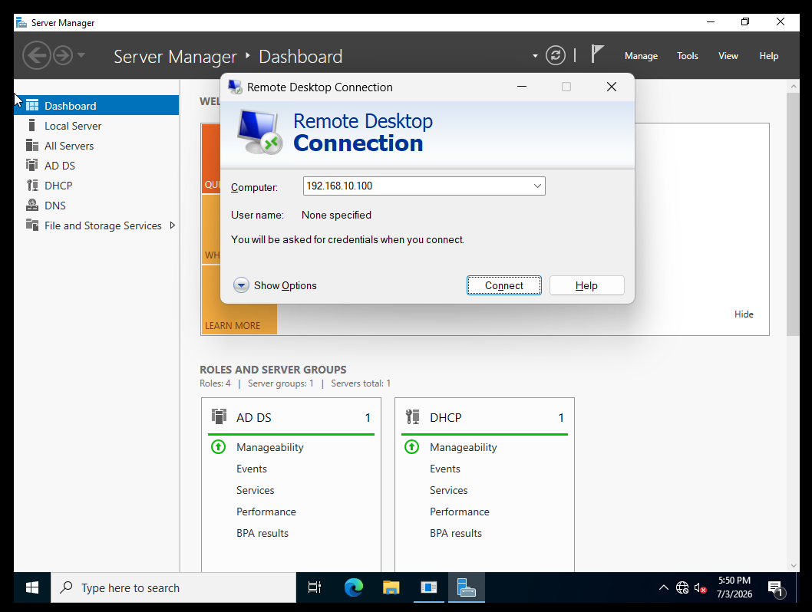
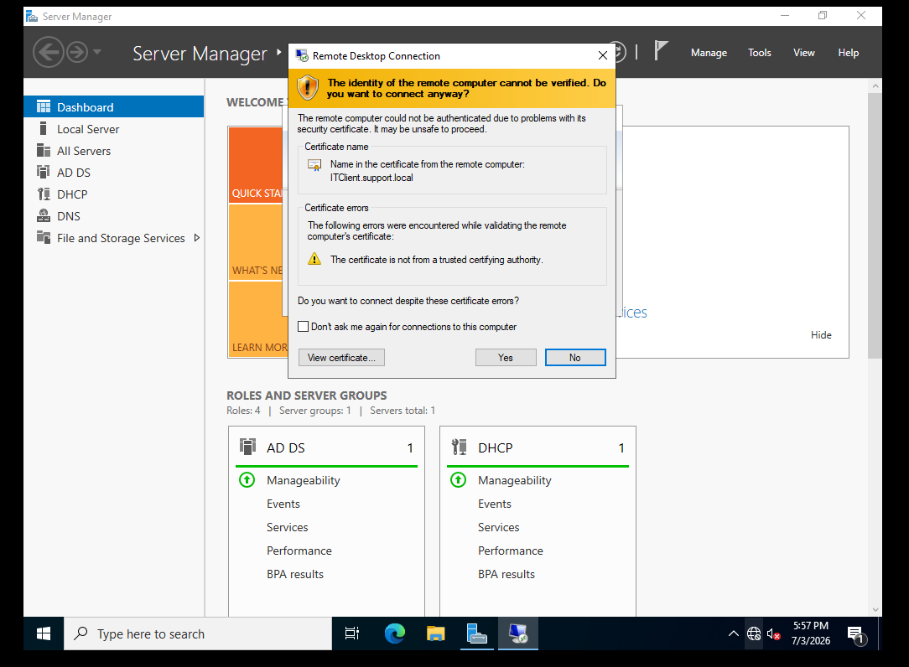
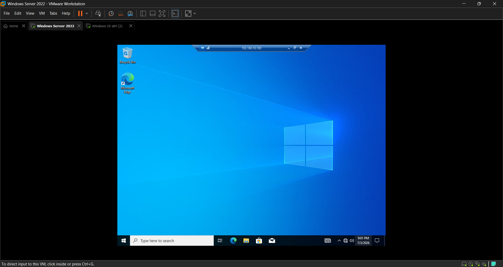
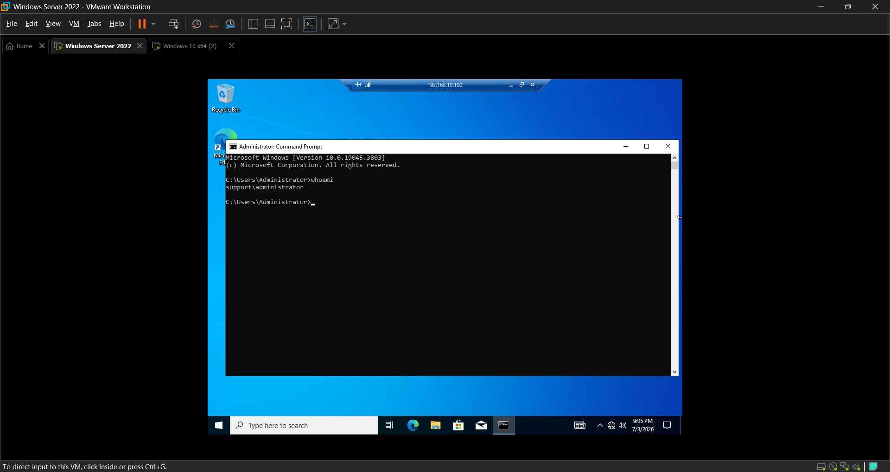

<div align="center">

# 🖥️ LAB 07 — REMOTE SUPPORT


> **Objective:** Enable Remote Desktop on the Windows 10 client, configure the firewall to allow RDP connections, and establish a remote desktop session from the Windows Server simulating a real helpdesk remote support scenario.

</div>

---

## 🖥️ Lab Environment

| Component | Details |
|---|---|
| Server OS | Windows Server 2022 |
| Client OS | Windows 10 Pro |
| Platform | VMware Workstation Pro |
| Domain | support.local |
| Client IP | 192.168.10.100 |
| Protocol | RDP (Remote Desktop Protocol) on port 3389 |

---

## 📚 Background

Remote Desktop Protocol is one of the most used tools in IT support. Instead of walking to a user's desk every time they have an issue, a helpdesk technician can connect to the user's machine remotely and troubleshoot directly from their own workstation. This saves time and allows support teams to assist users across multiple locations or floors without leaving their desk.

RDP works by transmitting the remote machine's display to the technician's screen while sending keyboard and mouse input back. The connection is encrypted and requires authentication, making it a secure option for remote support in an enterprise environment.

In a real helpdesk role you will use RDP constantly. Understanding how to enable it, troubleshoot connection issues, and navigate firewall settings is essential.

---

## 🔧 Steps

### Step 1 — Enable Remote Desktop on the Windows 10 Client

On the Windows 10 VM I right clicked the Start button and clicked **System**. I clicked **Remote Desktop** in the left panel and toggled **Enable Remote Desktop** to on. A confirmation dialog appeared and I clicked **Confirm** to apply the setting.

---

### Step 2 — Enable RDP Through the Firewall

After enabling Remote Desktop the initial connection attempt from the server failed. The Windows Firewall on the client was blocking incoming RDP connections. I opened PowerShell as Administrator on the Windows 10 client and ran:

```
Enable-NetFirewallRule -DisplayGroup "Remote Desktop"
```

This enabled the built in Windows Firewall rule that allows RDP traffic on port 3389.

---

### Step 3 — Open Remote Desktop Connection on the Server

On the Windows Server 2022 VM I pressed **Windows key + R** and typed `mstsc` to open the Remote Desktop Connection client. In the Computer field I entered the IP address of the Windows 10 client:

```
192.168.10.100
```

I clicked **Connect** to initiate the session.

---

### Step 4 — Accept the Certificate Warning

A certificate warning appeared on the first connection since the client's certificate had not been trusted before. This is expected behavior when connecting to a machine for the first time. I clicked **Yes** to accept and proceed with the connection.

---

### Step 5 — Authenticate and Connect

A login prompt appeared asking for credentials. I entered the domain administrator credentials and clicked OK. The remote desktop session opened successfully, displaying the Windows 10 client desktop from the server.

---

### Step 6 — Verify the Remote Session

Inside the RDP session I opened Command Prompt and ran:

```
whoami
```

The output confirmed the account that was logged into the remote session, verifying the connection was authenticated and active.

---

## ✅ Result

Remote Desktop was successfully enabled on the Windows 10 client and the firewall was configured to allow incoming RDP connections. A remote desktop session was established from Windows Server 2022 to the Windows 10 client simulating a real helpdesk remote support workflow. The session was authenticated using domain credentials and verified with the whoami command.

---

## 📸 Screenshots

| Screenshot | Description |
|---|---|
|  | Remote Desktop enabled on the Windows 10 client |
|  | PowerShell command enabling the Remote Desktop firewall rule |
|  | Remote Desktop Connection client on the server with the client IP entered |
|  | Certificate warning on first connection, accepted to proceed |
|  | Active RDP session showing the Windows 10 desktop from the server |
|  | whoami command confirming the authenticated user in the remote session |

---

<div align="center">

**[⬅️ Back to Lab Index](../../README.md)** | **[➡️ Next: Lab 08 — osTicket Setup](../08-osticket-setup/README.md)**

</div>
