

# 🎫 LAB 08 — OSTICKET SETUP

> **Objective:** Install and configure osTicket, a free open source helpdesk ticketing system, on Windows Server 2022 using XAMPP for the web server and database backend. Create a test ticket to verify the system is fully operational.

---

## 🖥️ Lab Environment

| Component | Details |
|---|---|
| Server OS | Windows Server 2022 |
| Platform | VMware Workstation Pro |
| Web Server | Apache via XAMPP |
| Database | MariaDB via XAMPP |
| Ticketing System | osTicket v1.18.4 |
| URL | http://localhost/osticket/osTicket-v1.18.4/upload |

---

## 📚 Background

In a real helpdesk environment every support request gets tracked through a ticketing system. Without one there is no record of what issues came in, who worked on them, how long they took, or whether they were resolved. osTicket is one of the most widely used open source helpdesk platforms and is similar in function to ServiceNow, Jira Service Management, and Zendesk.

This lab covers the full installation process from setting up the web server and database all the way through creating and receiving a live support ticket. Understanding how to install and configure a ticketing system is a valuable skill for any IT support role.

---

## 🔧 Steps

### Step 1 — Install IIS

I opened Server Manager and clicked **Add roles and features**. I selected **Web Server (IIS)** from the server roles list and completed the installation. IIS was installed to confirm the server could host web applications, but was later stopped to free up port 80 for Apache.

---

### Step 2 — Install XAMPP

I downloaded XAMPP from `https://www.apachefriends.org` directly on the server after temporarily switching the VM network adapter to NAT to gain internet access. After downloading I switched the adapter back to LAN Network and ran the XAMPP installer. XAMPP provides Apache as the web server and MariaDB as the database, both of which osTicket requires.

---

### Step 3 — Resolve the Port 80 Conflict and Start XAMPP Services

I opened the XAMPP control panel and clicked **Start** next to Apache. The attempt failed and the log reported port 80 in use, with a note that Apache would not start without the configured ports free. IIS was still bound to port 80 from Step 1, so I stopped it by running the following command in PowerShell:
Stop-Service W3SVC

I then went back to the XAMPP control panel and clicked **Start** next to both **Apache** and **MySQL**. Both services started successfully and showed green in the control panel.

---

### Step 4 — Verify Apache Is Running

I opened the browser on the server and navigated to `http://localhost`. The IIS default welcome page confirmed the web server was running. After stopping IIS and starting Apache through XAMPP, navigating to `http://localhost` confirmed Apache was now serving requests.

---

### Step 5 — Access phpMyAdmin

I navigated to `http://localhost/phpmyadmin` in the browser. phpMyAdmin loaded successfully showing the database server information and confirming that MySQL was running and accessible.

---

### Step 6 — Create the osTicket Database

In phpMyAdmin I clicked **New** in the left panel, entered `osticket` as the database name, and clicked **Create**. The database appeared in the left panel confirming it was created successfully.

---

### Step 7 — Download and Extract osTicket

I downloaded osTicket v1.18.4 from `https://osticket.com/download` after temporarily switching to NAT again. After switching back to LAN Network I extracted the zip file and copied the contents of the `upload` folder into:
C:\xampp\htdocs\osticket\osTicket-v1.18.4\upload

---

### Step 8 — Rename the Config File

I navigated to:
C:\xampp\htdocs\osticket\osTicket-v1.18.4\upload\include

I renamed `ost-sampleconfig.php` to `ost-config.php` so the osTicket installer could find and write to it.

---

### Step 9 — Enable the mysqli PHP Extension

The osTicket installer was failing with a PHP fatal error related to mysqli. I opened the XAMPP control panel, clicked **Config** next to Apache, and opened `php.ini`. I searched for `extension=mysqli` and removed the semicolon at the beginning of the line to enable it. I restarted Apache and confirmed on the installer prerequisites page that the MySQLi extension now showed as loaded.

---

### Step 10 — Run the osTicket Installer

I navigated to:
http://localhost/osticket/osTicket-v1.18.4/upload/setup/install.php

I filled in the installation form with the following details:

| Field | Value |
|---|---|
| Helpdesk Name | IT Support Lab |
| Default Email | support@support.local |
| Admin Username | itadmin |
| MySQL Hostname | 127.0.0.1 |
| MySQL Database | osticket |
| MySQL Table Prefix | ost_ |
| MySQL Username | root |
| MySQL Password | admin123 |

I clicked **Install Now** and the installation completed successfully.

---

### Step 11 — Post Installation Cleanup

After installation I completed the two required cleanup steps:

I navigated to the include folder and removed write access from `ost-config.php` by opening its Security properties and unchecking Write for the Everyone group.

I then deleted the setup folder from:
C:\xampp\htdocs\osticket\osTicket-v1.18.4\upload

---

### Step 12 — Verify the Customer Portal

I navigated to:
http://localhost/osticket/osTicket-v1.18.4/upload

The osTicket Support Center welcome page loaded confirming the installation was successful and the portal was accessible.

---

### Step 13 — Log Into the Staff Panel

I navigated to:
http://localhost/osticket/osTicket-v1.18.4/upload/scp

I logged in with the admin credentials set during installation. The staff dashboard loaded successfully.

---

### Step 14 — Submit a Test Ticket

From the customer portal I clicked **Open a New Ticket** and filled in the submission form. I disabled email validation in the Admin Panel under Emails to allow the ticket to be submitted without a live mail server. The ticket was submitted and confirmed with a ticket number.

---

### Step 15 — Verify the Ticket in the Staff Panel

I went back to the staff panel and confirmed the test ticket appeared in the queue with the correct subject, priority, and status. The ticket was received and logged correctly by the system.

---

## ✅ Result

XAMPP was installed and configured on Windows Server 2022 with Apache and MySQL running. The osTicket v1.18.4 helpdesk ticketing system was installed, configured, and verified end to end. A test support ticket was submitted through the customer portal and confirmed in the staff panel queue, proving the system is fully operational.

---

## 📸 Screenshots

| Screenshot | Description |
|---|---|
| 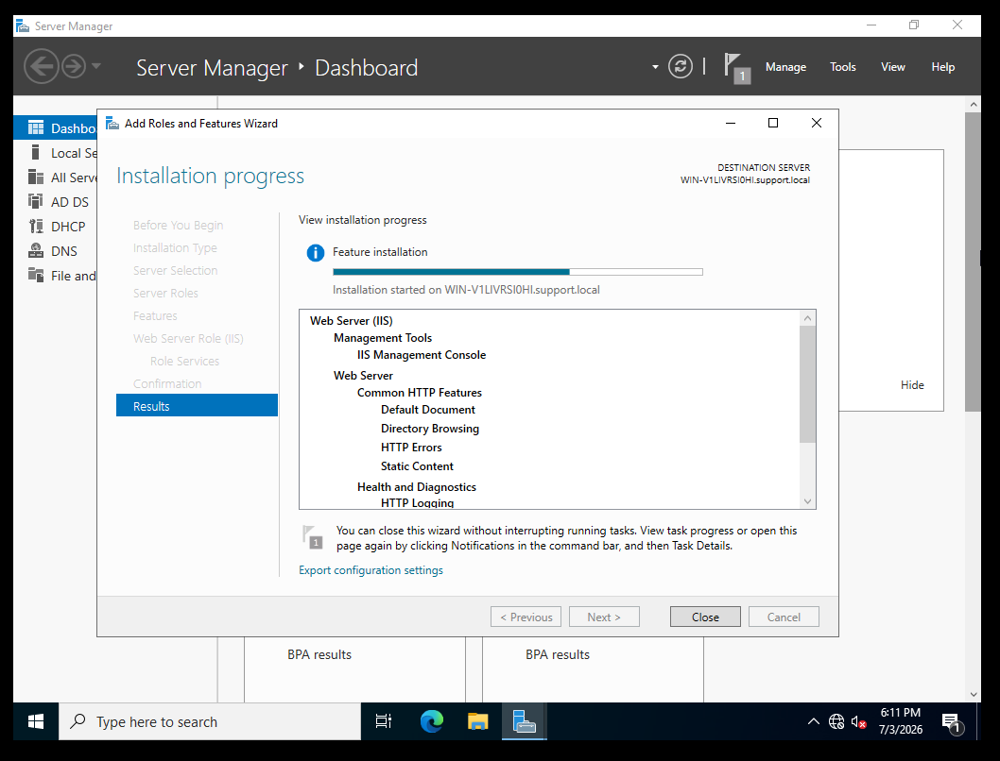 | IIS Web Server role installation in progress |
| 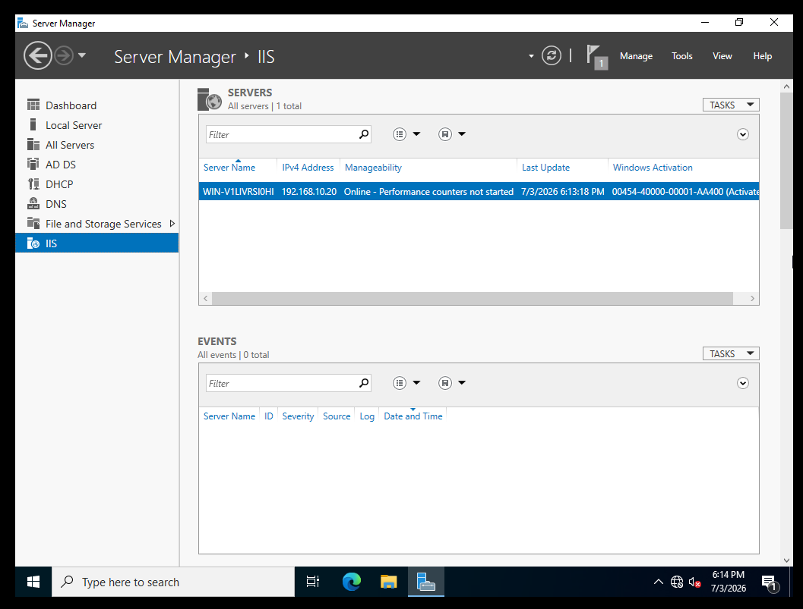 | IIS showing in Server Manager after installation |
| 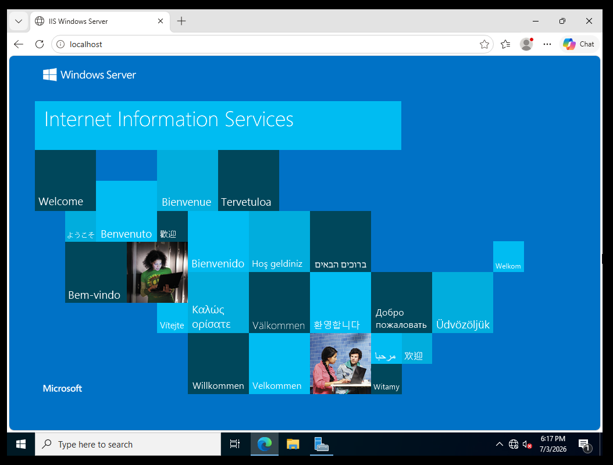 | IIS default welcome page confirming the web server is running |
| 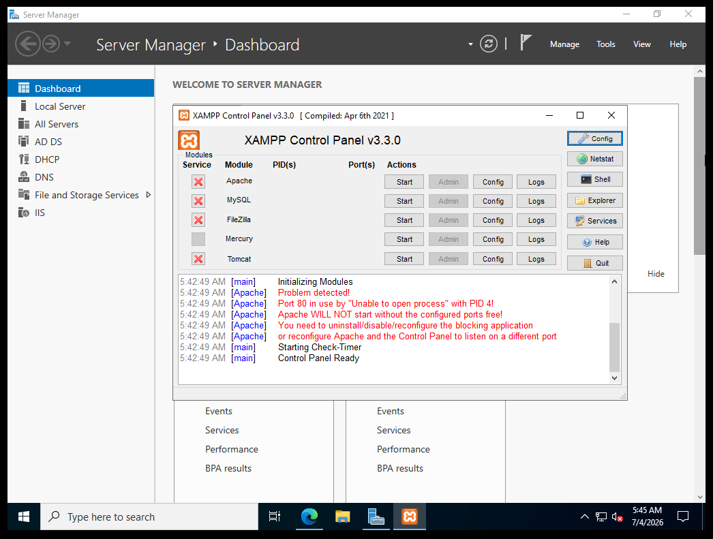 | XAMPP control panel showing Apache failing to start due to port 80 being in use by IIS |
| 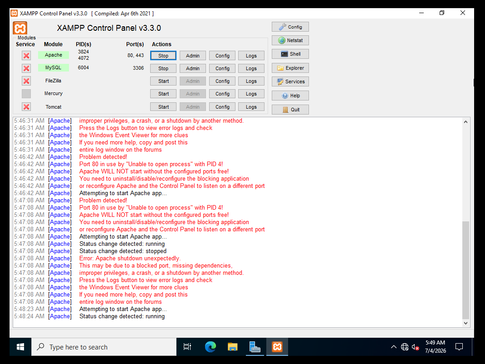 | XAMPP control panel showing Apache and MySQL running green after stopping IIS |
| 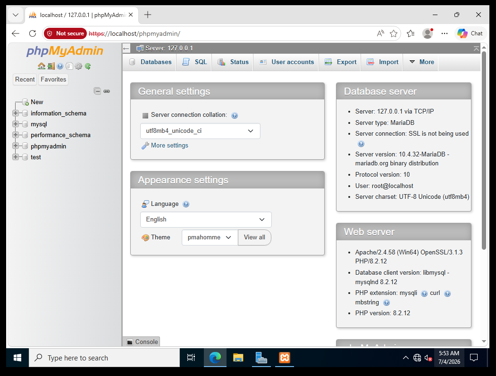 | phpMyAdmin dashboard confirming database access |
| 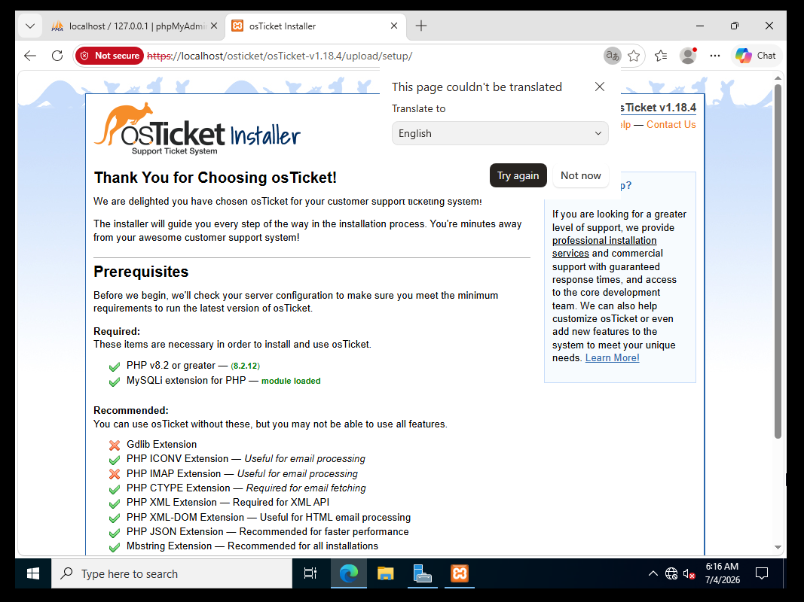 | osTicket installer prerequisites page confirming the MySQLi extension is loaded |
| 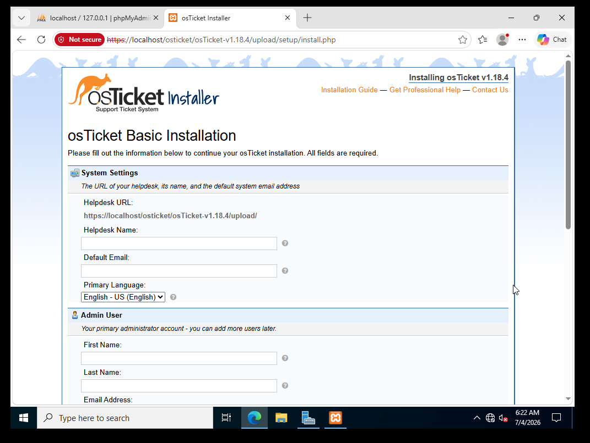 | osTicket installation form before entering details |
| 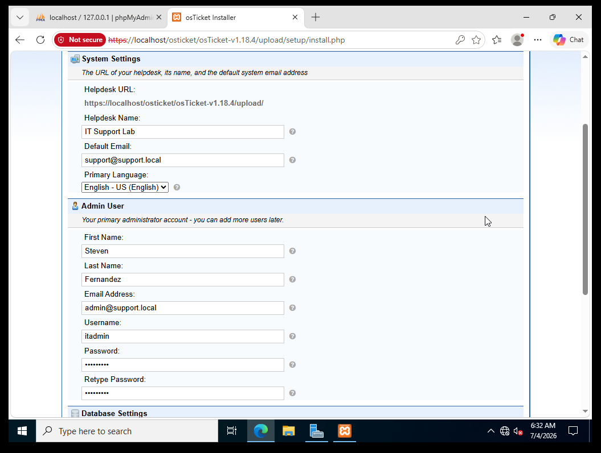 | osTicket installation form filled out with helpdesk name and admin user details |
| 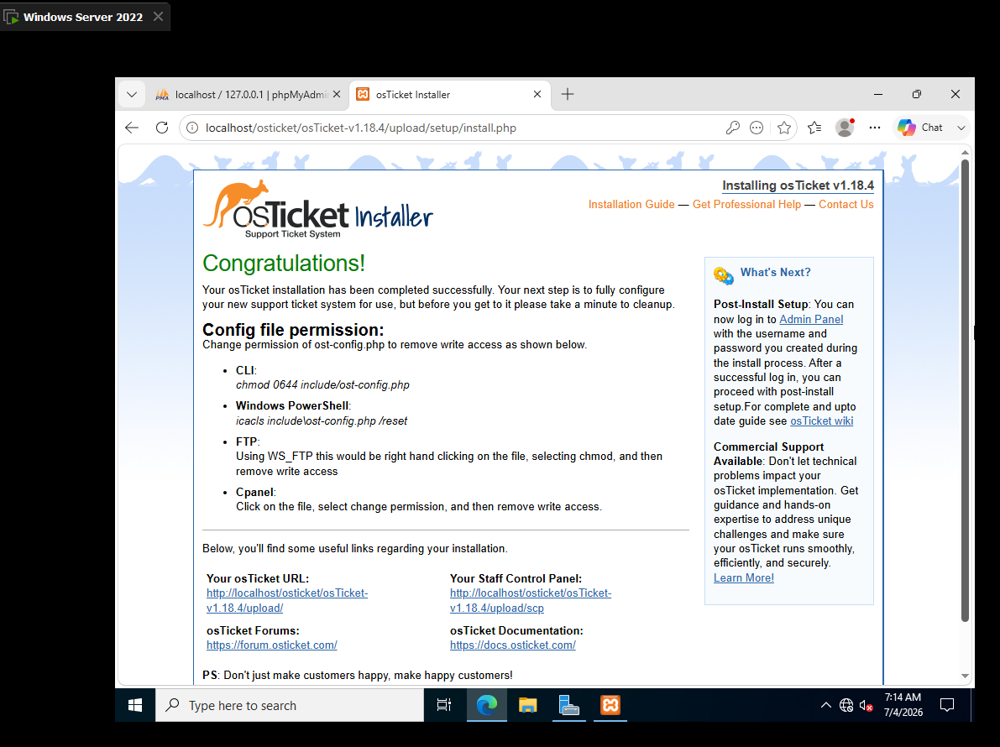 | osTicket congratulations page confirming successful installation |
| 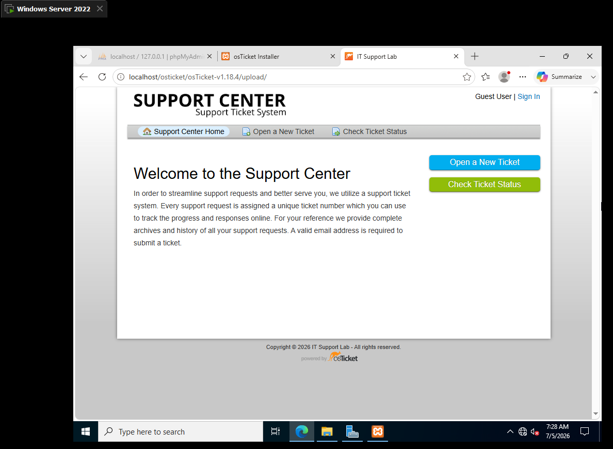 | osTicket customer portal showing the Support Center welcome page |
| 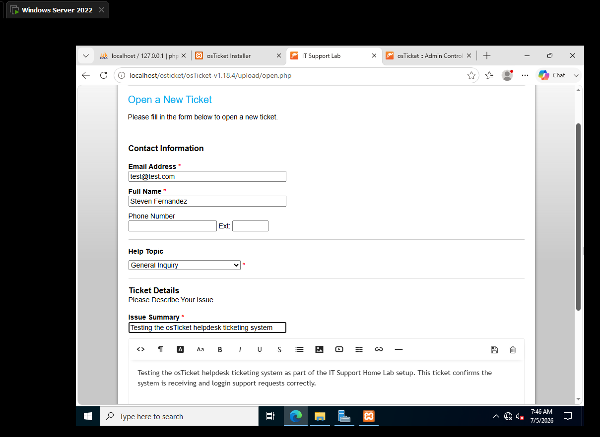 | New ticket submission form filled out with test ticket details |
| 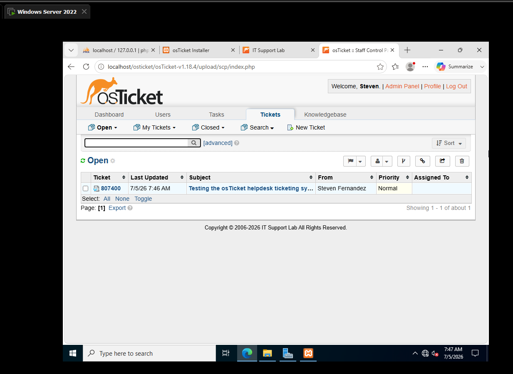 | Test ticket appearing in the osTicket staff panel queue |

---

**[⬅️ Back to Lab Index](../../README.md)** | **[➡️ Next: Lab 09 — Event Viewer and Logs](../09-event-viewer-logs/README.md)**

