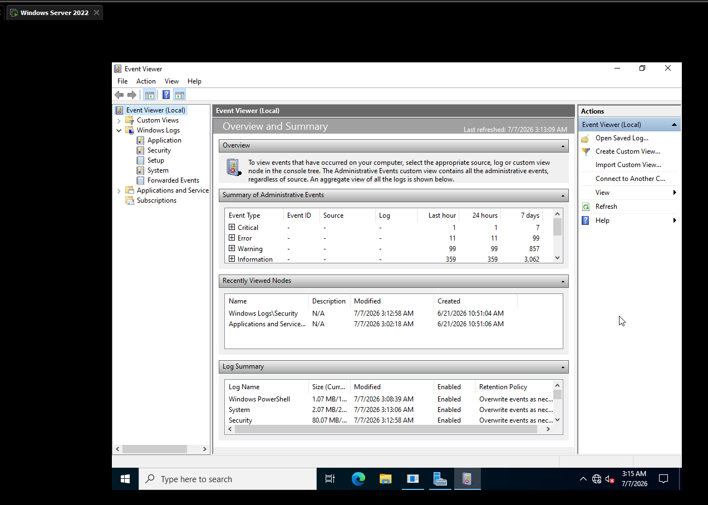
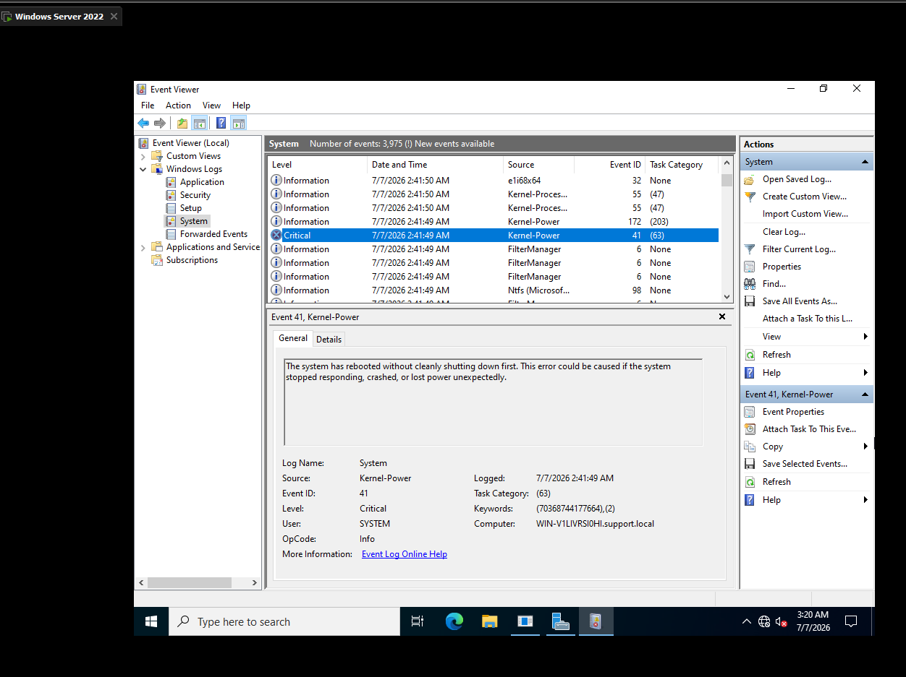
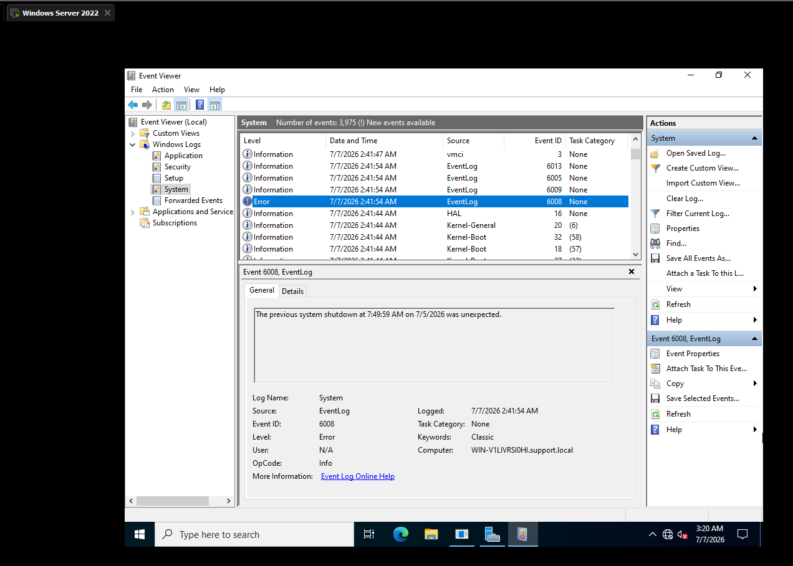
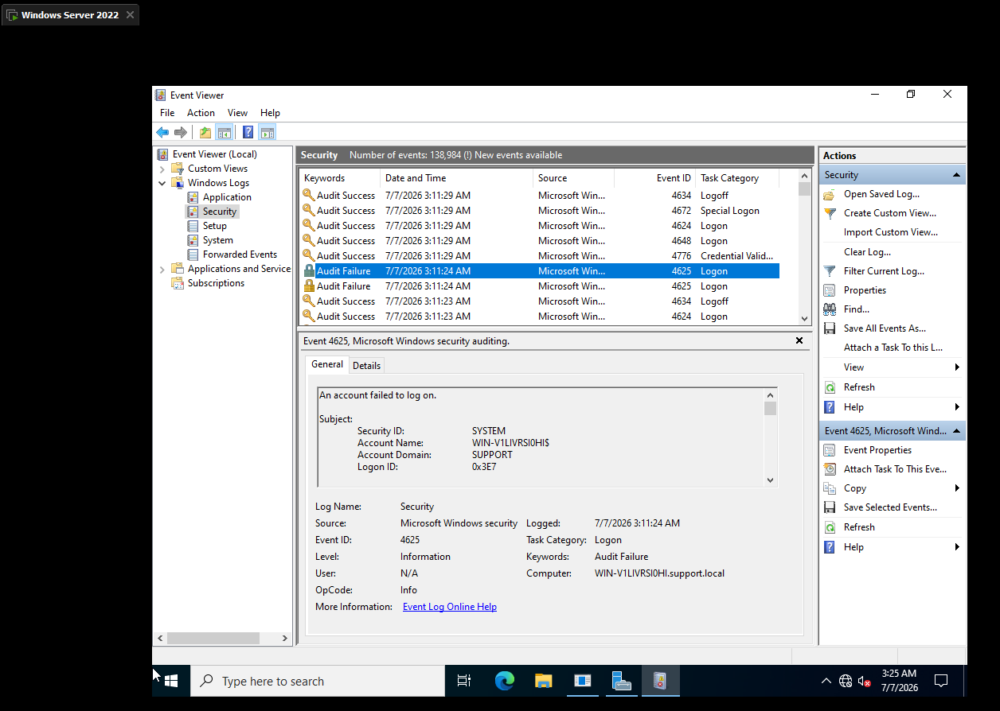
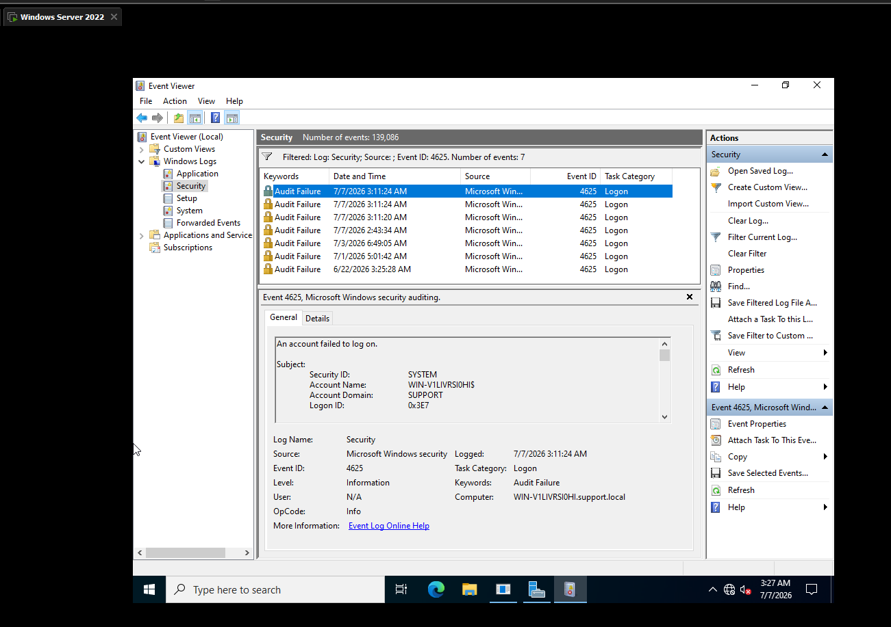
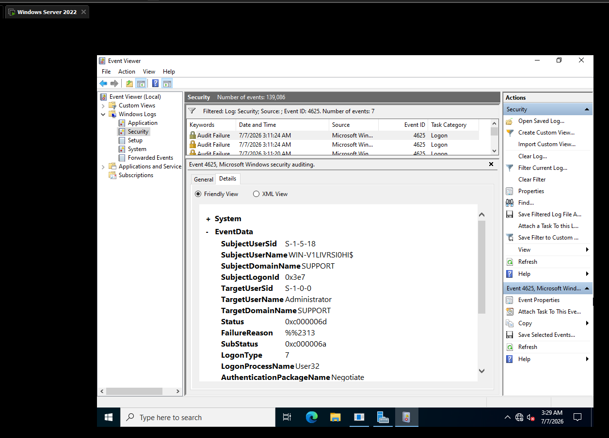
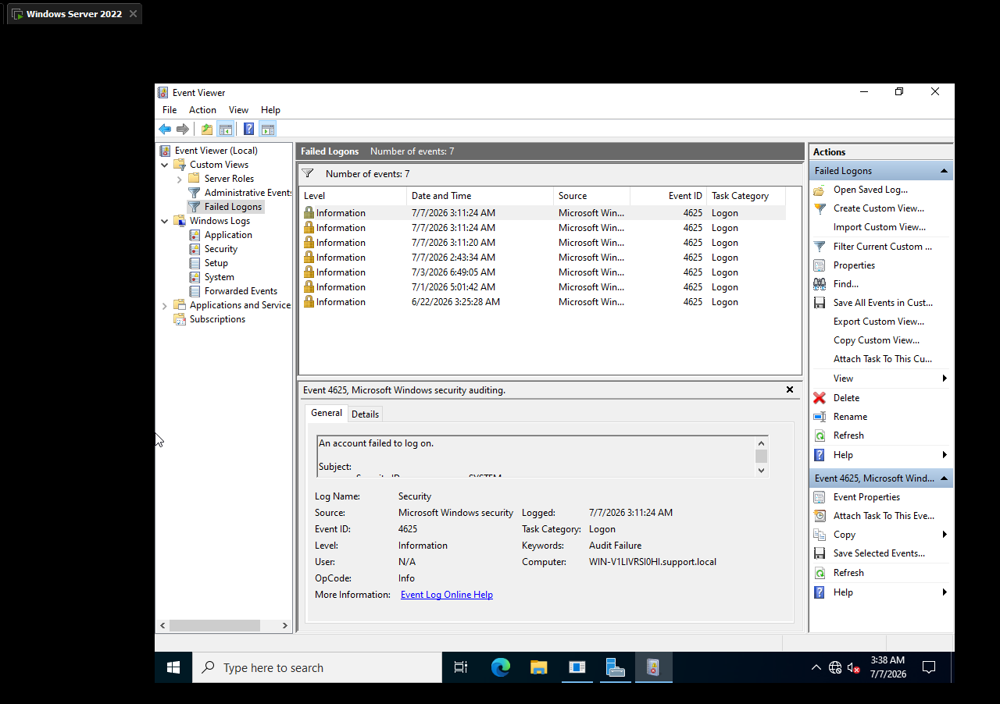
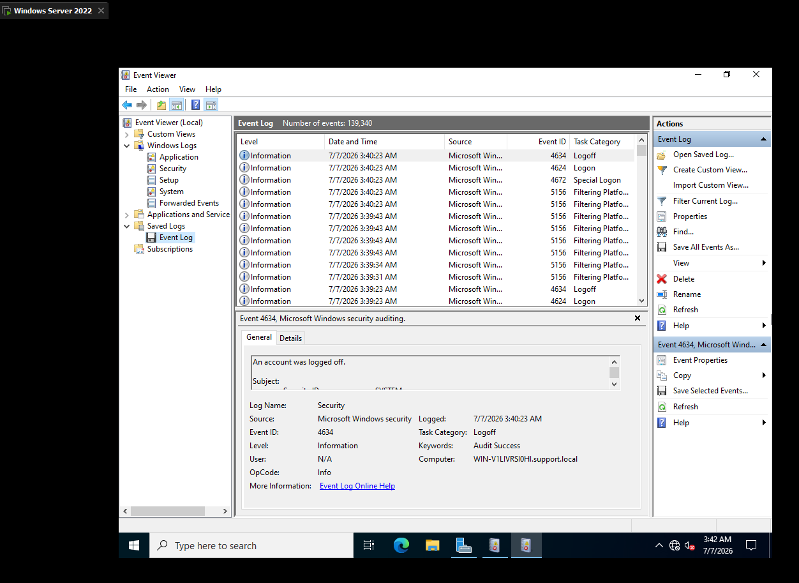

# 📋 LAB 09 — EVENT VIEWER AND LOGS

> **Objective:** Use Event Viewer on Windows Server 2022 to review system and security logs, filter for specific events, create a custom view, and export a log file for offline analysis.

---

## 🖥️ Lab Environment

| Component | Details |
|---|---|
| Server OS | Windows Server 2022 |
| Platform | VMware Workstation Pro |
| Domain Name | support.local |
| Server Hostname | WIN-V1LIVRS0HI |
| Tool | Event Viewer |

---

## 📚 Background

Event Viewer is one of the most important tools a support technician uses day to day. Every logon, logoff, service failure, driver issue, and unexpected reboot on a Windows machine gets recorded here, and knowing how to read, filter, and export these logs is essential for troubleshooting and for handing off evidence to another team.

This lab covers reviewing the System and Security logs, identifying a real critical event and a real failed logon attempt, filtering the log down to a specific Event ID, saving a reusable custom view, and exporting a log to a portable file.

---

## 🔧 Steps

### Step 1 — Open Event Viewer

I opened Event Viewer on the domain controller by running `eventvwr.msc`. The Overview and Summary page loaded showing a count of Critical, Error, Warning, and Information events over the last hour, 24 hours, and 7 days.

---

### Step 2 — Explore the Windows Logs Folder

I expanded **Windows Logs** in the left pane and confirmed the five subfolders: Application, Security, Setup, System, and Forwarded Events. Forwarded Events was empty since this is a single server setup with no log forwarding configured.

---

### Step 3 — Review the System Log

I clicked into the **System** log and reviewed the recent entries. Alongside the usual Information events I found one Critical event and one Error event, both worth investigating further.

---

### Step 4 — Investigate the Critical Event

I opened the Critical event and found it was **Event ID 41**, source **Kernel-Power**. The description stated the system had rebooted without cleanly shutting down first, and that this could be caused by the system stopping responding, crashing, or losing power unexpectedly. Since this is a virtual machine, this was most likely caused by a VM reset or power action in VMware rather than an actual hardware failure.

---

### Step 5 — Investigate the Error Event

I opened the Error event and found it was **Event ID 6008**, source **EventLog**. The description confirmed the previous system shutdown was unexpected. This event pairs directly with the Kernel-Power 41 event from Step 4, Windows logs both when it detects an unclean shutdown, and being able to read them together is a real skill used when triaging unexpected reboots.

---

### Step 6 — Review the Security Log

I clicked into the **Security** log. As expected on a domain controller, the log contained a large volume of entries, mostly Event ID 4624 successful logons along with 4634 logoffs and 4672 special logon events.

---

### Step 7 — Generate a Failed Logon Event

To have a real failed logon to work with, I logged off the current session and attempted to log back in as the built in Administrator account with the wrong password on purpose. This produced a failed logon attempt, which I then followed with a correct login. Back in the Security log I located the new **4625** failed logon entry sitting directly above a **4624** successful logon, confirming both attempts had been captured.

---

### Step 8 — Filter the Log by Event ID

I right clicked the **Security** log and selected **Filter Current Log**. I set the Event ID field to `4625` and applied the filter. The log narrowed down to seven matching failed logon events out of over 139,000 total entries in the log.

---

### Step 9 — Examine the Event Details

I double clicked into the most recent 4625 event and reviewed the Details tab. The EventData showed **TargetUserName: Administrator**, **LogonType: 7**, and **FailureReason: %%2313**, which translates to an unknown username or bad password. LogonType 7 specifically indicates this was a workstation unlock attempt rather than a fresh interactive logon, meaning someone tried to unlock a locked session with the wrong password.

---

### Step 10 — Create a Custom View

I right clicked **Custom Views** and selected **Create Custom View**. I set the log to Security and the Event ID to 4625, then saved it under the name Failed Logons. This gives a persistent saved filter I can return to instantly instead of reapplying Filter Current Log every time I need to check for failed login attempts.

---

### Step 11 — Export the Log

I right clicked the Security log and selected **Save All Events As**, then exported it as an EVTX file. I reopened the exported file through **Open Saved Log**, and it appeared under a new Saved Logs section named Event Log, successfully reloading all 139,340 events. This confirmed the export was valid and could be handed off or reviewed independently of the live log.

---

## ✅ Result

Event Viewer was used to review the System and Security logs on Windows Server 2022. A real critical event and error event tied to an unclean shutdown were identified and explained, a failed logon attempt was generated and traced through its Details tab, a custom view was created to persistently filter for failed logons, and the Security log was exported and verified by reopening it as a saved log. This confirmed a working understanding of how to monitor, filter, and preserve Windows event logs for troubleshooting purposes.

---

## 📸 Screenshots

| Screenshot | Description |
|---|---|
|  | Event Viewer overview with Windows Logs expanded showing Application, Security, Setup, System, and Forwarded Events |
|  | System log Critical event, Kernel-Power Event ID 41, confirming an unclean shutdown |
|  | System log Error event, EventLog Event ID 6008, confirming the previous shutdown was unexpected |
|  | Security log showing a 4625 failed logon and nearby 4624 and 4634 logon and logoff events |
|  | Security log filtered to Event ID 4625, showing seven matching failed logon events |
|  | Details tab of the 4625 event showing TargetUserName, LogonType, and FailureReason |
|  | Custom View named Failed Logons saved under Custom Views |
|  | Exported EVTX file reopened under Saved Logs, confirming the export was successful |

---

**[⬅️ Back to Lab Index](../../README.md)** | **[➡️ Next: Lab 10 — Password Reset and Account Unlock](../10-password-reset-account-unlock/README.md)**

