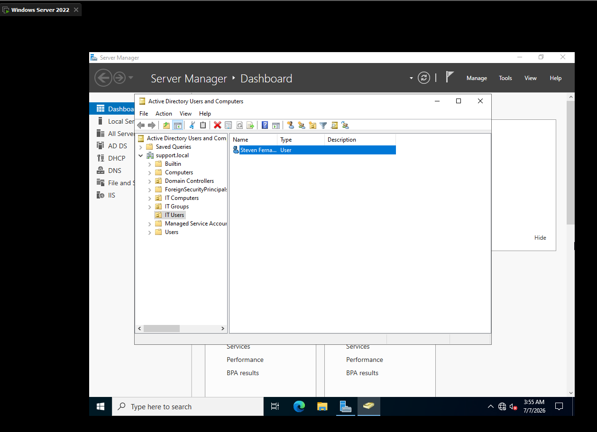
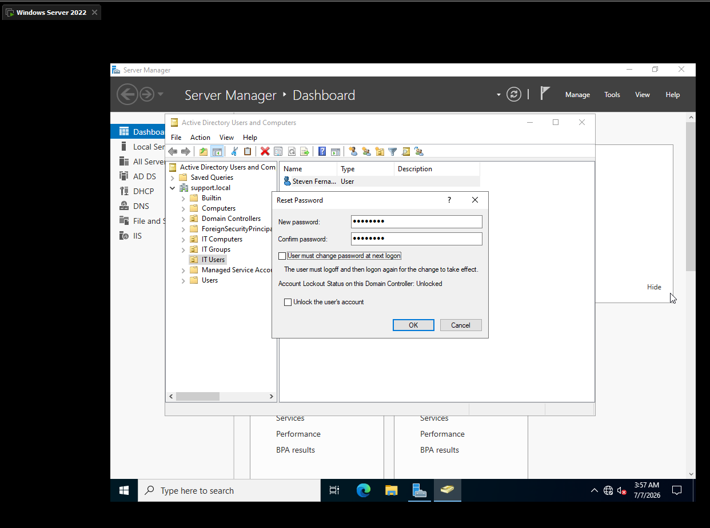
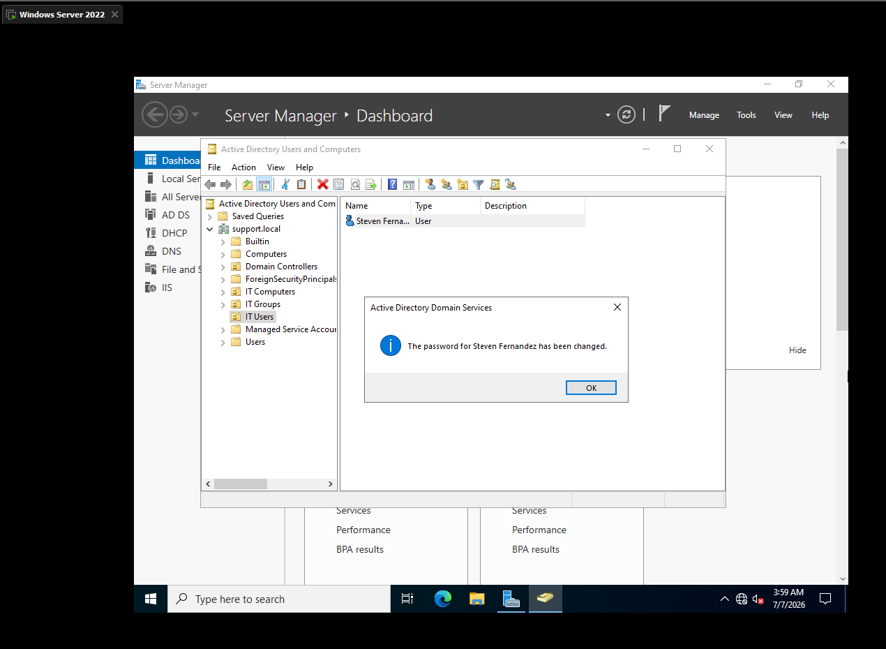
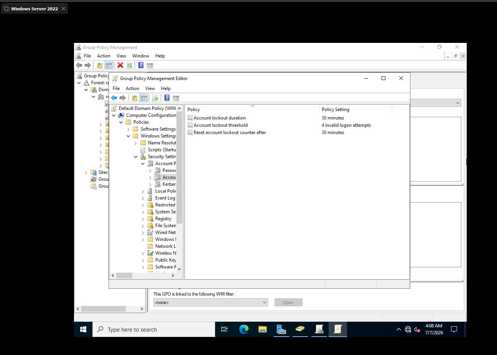
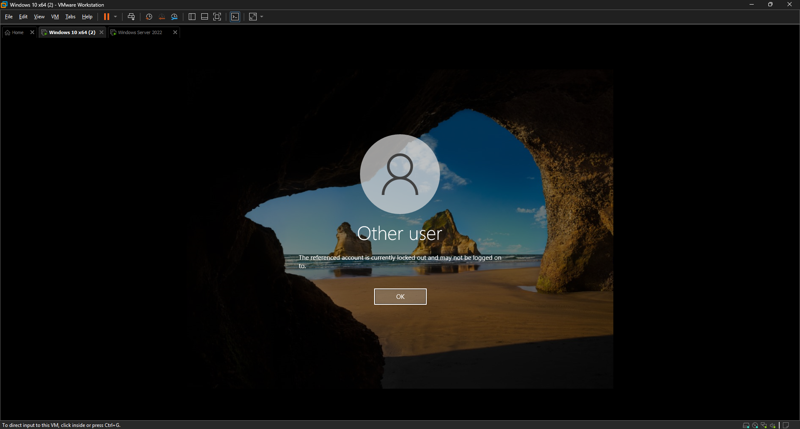
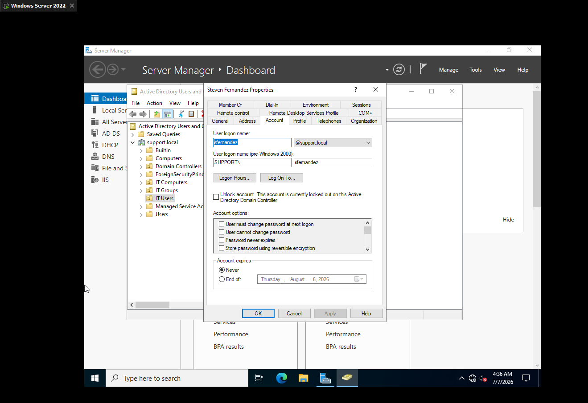
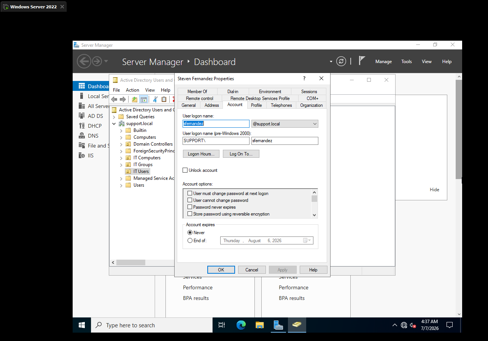
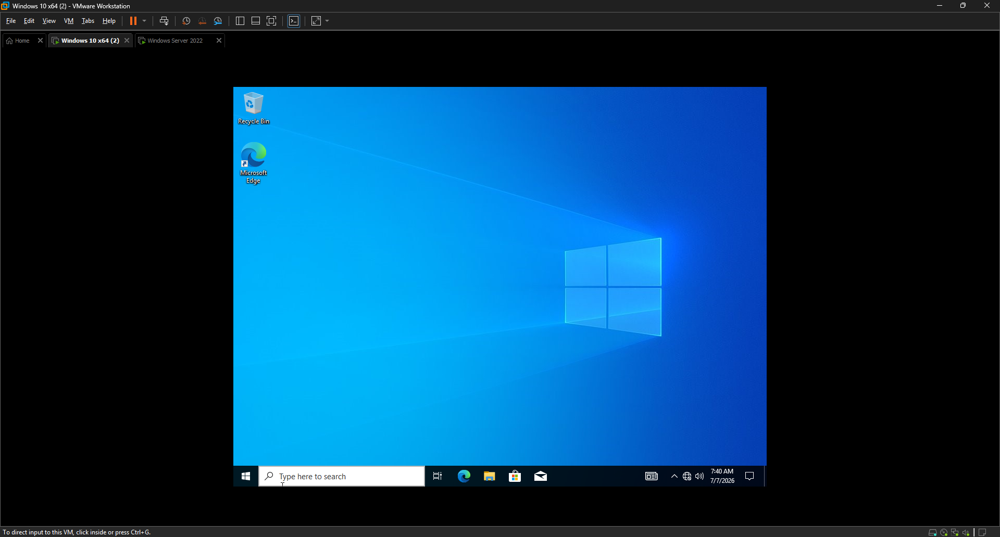

# 🔐 LAB 10 — PASSWORD RESET AND ACCOUNT UNLOCK

> **Objective:** Reset a domain user's password and resolve an account lockout using Active Directory Users and Computers, one of the most common tickets a support technician handles.

---

## 🖥️ Lab Environment

| Component | Details |
|---|---|
| Server OS | Windows Server 2022 |
| Platform | VMware Workstation Pro |
| Domain Name | support.local |
| Domain User | sfernandez (Steven Fernandez) |
| Tool | Active Directory Users and Computers |

---

## 📚 Background

Password resets and account lockouts make up a large share of everyday helpdesk tickets. Users forget passwords, mistype them too many times, or get locked out after being away from their desk. Being able to quickly locate a user account, reset their password, and safely unlock it in Active Directory is a core skill for any support role.

This lab covers resetting a domain user's password, configuring an account lockout policy through Group Policy, intentionally triggering a lockout to see it from both the user and admin side, and resolving it.

---

## 🔧 Steps

### Step 1 — Open Active Directory Users and Computers

I opened Active Directory Users and Computers on the domain controller by running `dsa.msc`.

---

### Step 2 — Locate the User Account

I navigated to the IT Users OU and located the Steven Fernandez account.

---

### Step 3 — Reset the Password

I right clicked the Steven Fernandez account and selected Reset Password. I entered a new password and left User must change password at next logon unchecked, since I was setting the password directly rather than issuing a temporary one. This same dialog also showed the Account Lockout Status as Unlocked at the time.

---

### Step 4 — Verify the Password Reset

After clicking OK, a confirmation dialog appeared confirming the password for Steven Fernandez had been changed.

---

### Step 5 — Configure the Account Lockout Policy

To be able to demonstrate a real lockout, I opened Group Policy Management, right clicked Default Domain Policy, and selected Edit. Under Computer Configuration, Policies, Windows Settings, Security Settings, Account Policies, Account Lockout Policy, I set the Account lockout threshold to 4 invalid logon attempts. I then ran `gpupdate /force` on the client to apply the updated policy immediately.

---

### Step 6 — Lock the Account on Purpose

On the Windows 10 client, I logged off and attempted to log in as sfernandez with the wrong password 4 times in a row. On the fourth attempt the system displayed a message confirming the referenced account was currently locked out and could not be logged on to.

---

### Step 7 — Verify the Lockout in Active Directory

Back on the domain controller, I opened the properties for Steven Fernandez in Active Directory Users and Computers and confirmed on the Account tab that Account is locked out was checked, verifying the lockout from the administrative side.

---

### Step 8 — Unlock the Account

I unchecked Account is locked out on the Account tab and clicked Apply. Reopening the properties confirmed the checkbox had cleared, indicating the account was unlocked.

---

### Step 9 — Verify the Fix

On the Windows 10 client, I logged in as sfernandez using the correct password. The login succeeded and the desktop loaded normally, confirming the account was fully restored.

---

## ✅ Result

A domain user's password was reset through Active Directory Users and Computers. An account lockout policy was configured through Group Policy and confirmed applied on the client. The sfernandez account was intentionally locked out after 4 failed logon attempts, verified as locked from the admin side, unlocked, and confirmed working with a successful login. This demonstrated the full lifecycle of a password reset and account unlock ticket from start to finish.

---

## 📸 Screenshots

| Screenshot | Description |
|---|---|
|  | Steven Fernandez account located in the IT Users OU |
|  | Reset Password dialog showing new password fields and Account Lockout Status |
|  | Confirmation that the password for Steven Fernandez was changed |
|  | Account Lockout Policy showing threshold set to 4 invalid logon attempts |
|  | Login screen showing the account is currently locked out |
|  | Account tab in Active Directory showing Account is locked out checked |
|  | Account tab in Active Directory confirming the account is unlocked |
|  | Successful login as sfernandez after the account was unlocked |

---

**[⬅️ Back to Lab Index](../../README.md)**

